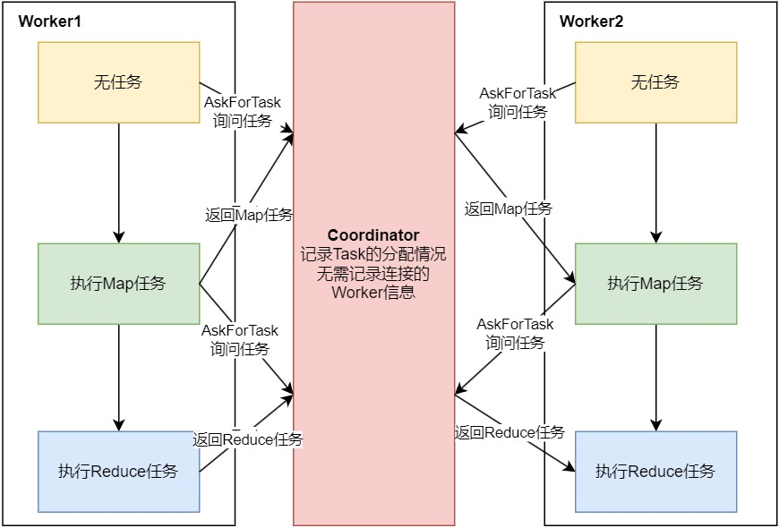
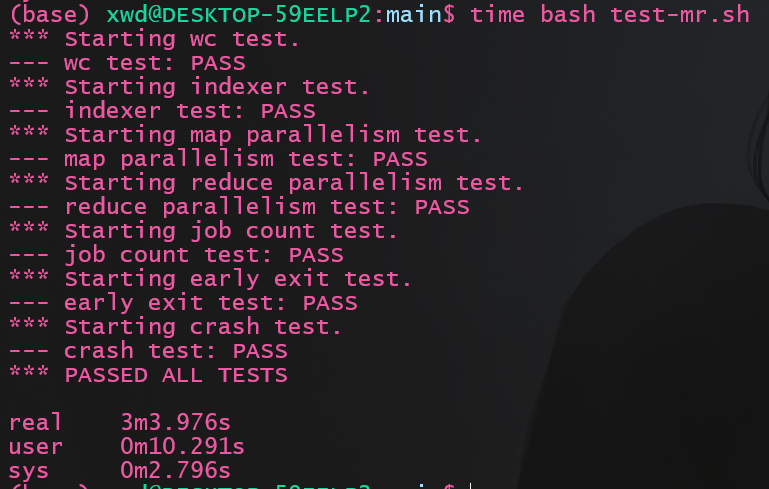
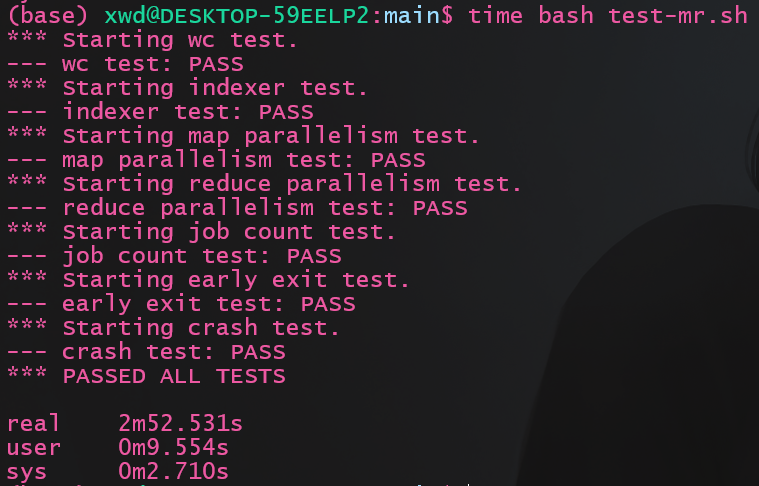
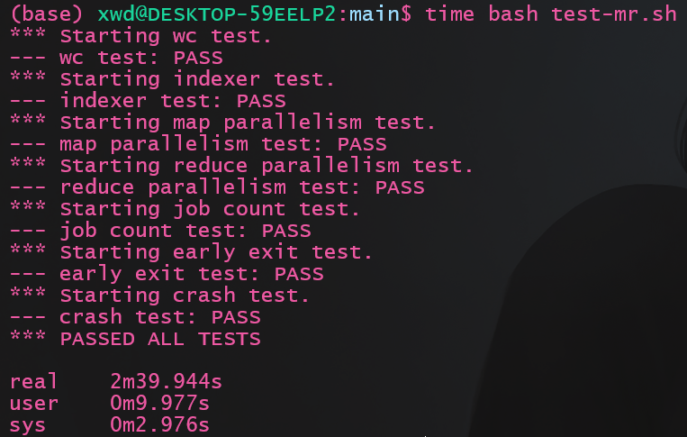

# 1 实验介绍
本次实验是实现一个简易版本的`MapReduce`编程框架,官方文档在这里:[lab1文档](https://pdos.csail.mit.edu/6.824/labs/lab-mr.html), 强烈建议先阅读`MapReduce`的[论文](https://pdos.csail.mit.edu/6.824/papers/mapreduce.pdf), 难度主要体现在设计上, 实际的代码实现倒是相对简单, 这也得益于`go`的语言特性, 比`CMU15445`使用Cpp写代码方便多了。实验需要实现的是`Coordinator`和`Worker`的设计, 具体实现细节十分自由(~~无从下手~~)

我的代码实现点这里： https://github.com/ToniXWD/MIT6.8540/tree/lab1

# 2 既有框架解读
解读现有的框架设计是第一步。
## 2.1 代码解读
1. 阅读`src/main/mrcoordinator.go`可知：
    服务进程通过`MakeCoordinator`启动了一个`Coordinator` c, `c.server()`中启用了一个协程用于接受`RPC`调用:`go http.Serve(l, nil)`, 需要注意的是, 在 Go 的 `net/http` 包中, 使用 `http.Serve(l, nil)` 启动 `HTTP` 服务器以侦听和处理请求时，服务器会为每个进来的请求自动启动一个新的协程。这意味着每个 RPC 调用都是在其自己的独立协程中被处理的，允许并发处理多个请求。因此, 我们的设计可能需要使用锁等同步原语实现共享资源的保护, 同时`Coordinator`不会主动与`Worker`通信(除非自己额外实现), 只能通过`Worker`的`RPC`通信来完成任务。同时， 当所有任务完成时， `Done`方法将会返回`false`, 从而将`Coordinator`关闭。
2. 阅读`src/main/mrworker.go`
   可以得知，`mrworker.go`仅仅通过`Worker`函数来运行, 因此`Worker`函数需要完成请求任务、执行任务、报告任务执行状态等多种任务。因此可以猜测，Worker需要再这个函数里不断地轮训`Coordinator`，根据`Coordinator`的不同回复驱使当前`Worker`完成各种任务。
## 2.2 任务误区解读
1. `Map`、`Reduce`任务、`Coordinator`和`Worker`的关系如何?
   这些任务(文中此后称为`Task`)与`Worker`是什么关系呢? 是否存在对应关系? 这些对应关系需要记录吗? 通常, 在常见的主从关系中, 主节点需要记录从节点的信息,例如线程id等表名身份的信息, 但在我们的`MapReduce`中却没有这样的必要, 因为`Worker`节点是可以扩容的, 而`Coordinator`与`Worker`之间只有传递`Task`相关信息的需求, 因此`Coordinator`只需要记录`Task`任务的状态即可, `Task`分配给`Worker`后执行可能成功或失败, 因此`Coordinator`还需要维护任务执行的时间信息, 以便在超时后重新分配任务。因此，`Map`、`Reduce`任务、`Coordinator`和`Worker`的关系可以参考下图:

   
    
    `Worker`可能在不同时间执行不同的`Task`, 也可能什么也不做(初始状态或等候所有`Map Task`完成时可能会闲置)

2. `Map`、`Reduce`任务有多少个? 如何分配?
   - `Map Task`实际上在此实验中被简化了, 每个`Map Task`的任务就是处理一个`.txt`文件, 因此`Map Task`的数量实际上就是`.txt`文件的数量。 因此, 每个`.txt`文件对应的`Map Task`需要`Coordinator`记录其执行情况并追踪。
   - `Reduce Task`的数量是`nReduce`。由于`Map Task`会将文件的内容分割为指定的`nReduce`份, 每一份应当由序号标明, 拥有这样的序号的多个`Map Task`的输出汇总起来就是对应的`Reduce Task`的输入。

3. 中间文件的格式是怎么样的? `Reduce`任务如何选择中间文件作为输入?
   因为`Map Task`分割采用的是统一的哈希函数`ihash`, 所以相同的`key`一定会被`Map Task`输出到格式相同的中间文件上。例如在`wc`任务中, `Map Task 1`和`Map Task 2`输入文件中都存在`hello`这个词, `Map Task 1`中所有的`hello`会被输出到`mr-out-1-5`这个中间文件, `1`代表`Map Task`序号, `5`代表被哈希值取模的结果。那么，`Map Task 2`中所有的`hello`会被输出到`mr-out-2-5`这个中间文件。那么`Reduce Task 5`读取的就是形如`mr-out-*-5`这样的文件。

# 3 设计与实现
## 3.1 `RPC`设计
### 3.1.1. 消息类型
,通信时首先需要确定这个消息是什么类型, 通过前述分析可知, 通信的信息类型包括: 
- `Worker`请求任务
- `Coordinator`分配`Reduce`或`Map`任务
- `Worker`报告`Reduce`或`Map`任务的执行情况(成功或失败)
- `Coordinator`告知`Worker`休眠（暂时没有任务需要执行）
- `Coordinator`告知`Worker`退出（所有任务执行成功）

每一种消息类型会需要附带额外的信息, 例如`Coordinator`分配任务需要告知任务的ID, `Map`任务还需要告知`NReduce`,和输入文件名。
综上考虑, 消息类型的定义如下(`Send`和`Reply`是从`Worker`视角出发的):
```go
const (
    AskForTask      MsgType = iota // `Worker`请求任务
    MapTaskAlloc                   // `Coordinator`分配`Map`任务
    ReduceTaskAlloc                // `Coordinator`分配`Reduce`任务
    MapSuccess                     // `Worker`报告`Map`任务的执行成功
    MapFailed                      // `Worker`报告`Map`任务的执行失败
    ReduceSuccess                  // `Worker`报告`Reduce`任务的执行成功
    ReduceFailed                   //`Worker`报告`Reduce`任务的执行失败
    Shutdown                       // `Coordinator`告知`Worker`退出（所有任务执行成功）
    Wait                           //`Coordinator`告知`Worker`休眠（暂时没有任务需要执行）
)

type MessageSend struct {
    MsgType MsgType
    TaskID  int // `Worker`回复的消息类型如MapSuccess等需要使用
}

type MessageReply struct {
    MsgType  MsgType
    NReduce  int    // MapTaskAlloc需要告诉Map Task 切分的数量
    TaskID   int    // 任务Id用于选取输入文件
    TaskName string // MapSuccess专用: 告知输入.txt文件的名字
}
```
### 3.1.2 通信函数设计
在我的设计中，`Worker`只需要有2个动作: 
  - 向`Coordinator`请求`Task`
  - 向`Coordinator`报告之前的`Task`的执行情况

因此, `worker.go`中通信函数应该是下面的样子:
```go
func CallForReportStatus(succesType MsgType, taskID int) error {
    // 报告Task执行情况
    // declare an argument structure.
    args := MessageSend{
        MsgType: succesType,
        TaskID:  taskID,
    }
    
    err := call("Coordinator.NoticeResult", &args, nil)

    return err
}
func CallForTask() *MessageReply {
    // 请求一个Task
    // declare an argument structure.
    args := MessageSend{
        MsgType: AskForTask,
    }

    // declare a reply structure.
    reply := MessageReply{}

    // send the RPC request, wait for the reply.
    err := call("Coordinator.AskForTask", &args, &reply)
    if err == nil {
        // fmt.Printf("TaskName %v, NReduce %v, taskID %v\n", reply.TaskName, reply.NReduce, reply.TaskID)
        return &reply
    } else {
        // log.Println(err.Error())
        return nil
    }
}
```
在`coordinator.go`有相应的处理函数:
```go
func (c *Coordinator) AskForTask(req *MessageSend, reply *MessageReply) error {}
func (c *Coordinator) NoticeResult(req *MessageSend, reply *MessageReply) error {}
```
这些处理函数则需要进一步的设计。
## 3.2 `Worker`设计
### 3.2.1 `Worker`主函数设计
由之前的分析可以看出，`Woker`所做的内容就是不断的请求任务、执行任务和回复任务执行情况，因此，可以很容易地写出`Worker`函数:
```go
// main/mrworker.go calls this function.
func Worker(mapf func(string, string) []KeyValue,
	reducef func(string, []string) string) {

	// Your worker implementation here.

	for {
		// 循环请求
		replyMsg := CallForTask()

		switch replyMsg.MsgType {
		case MapTaskAlloc:
			err := HandleMapTask(replyMsg, mapf)
			if err == nil {
				_ = CallForReportStatus(MapSuccess, replyMsg.TaskID)
			} else {
				// log.Println("Worker: Map Task failed")
				_ = CallForReportStatus(MapFailed, replyMsg.TaskID)
			}
		case ReduceTaskAlloc:
			err := HandleReduceTask(replyMsg, reducef)
			if err == nil {
				_ = CallForReportStatus(ReduceSuccess, replyMsg.TaskID)
			} else {
				// log.Println("Worker: Map Task failed")
				_ = CallForReportStatus(ReduceFailed, replyMsg.TaskID)
			}
		case Wait:
			time.Sleep(time.Second * 10)
		case Shutdown:
			os.Exit(0)
		}
		time.Sleep(time.Second)
	}
}
```
### 3.2.2 `Map Task`执行函数
`HandleMapTask`函数是执行具体的`MapTask`, 这样部分很简单, 可以从`mrsequential.go`中偷代码:
```go
func HandleMapTask(reply *MessageReply, mapf func(string, string) []KeyValue) error {
	file, err := os.Open(reply.TaskName)
	if err != nil {
		return err
	}
	defer file.Close()

	content, err := io.ReadAll(file)
	if err != nil {
		return err
	}

	// 进行mapf
	kva := mapf(reply.TaskName, string(content))
	sort.Sort(ByKey(kva))

	oname_prefix := "mr-out-" + strconv.Itoa(reply.TaskID) + "-"

	key_group := map[string][]string{}
	for _, kv := range kva {
		key_group[kv.Key] = append(key_group[kv.Key], kv.Value)
	}

	// 先清理可能存在的垃圾
	// TODO: 原子重命名的方法
	_ = DelFileByMapId(reply.TaskID, "./")

	for key, values := range key_group {
		redId := ihash(key)
		oname := oname_prefix + strconv.Itoa(redId%reply.NReduce)
		var ofile *os.File
		if _, err := os.Stat(oname); os.IsNotExist(err) {
			// 文件夹不存在
			ofile, _ = os.Create(oname)
		} else {
			ofile, _ = os.OpenFile(oname, os.O_APPEND|os.O_CREATE|os.O_WRONLY, 0644)
		}
		enc := json.NewEncoder(ofile)
		for _, value := range values {
			err := enc.Encode(&KeyValue{Key: key, Value: value})
			if err != nil {
				ofile.Close()
				return err
			}
		}
		ofile.Close()
	}
	return nil
}
```
虽然偷了很多代码, 但是有家店需要注意, 因为之前的`Worker`可能写入了一部分数据到中间文件后失败的情况, 之后`Coordinator`重新分配任务时, 文件是可能存在脏数据的, 因此需要先执行清理:
```go
_ = DelFileByMapId(reply.TaskID, "./")
```

```go
func DelFileByMapId(targetNumber int, path string) error {
	// 创建正则表达式，X 是可变的指定数字
	pattern := fmt.Sprintf(`^mr-out-%d-\d+$`, targetNumber)
	regex, err := regexp.Compile(pattern)
	if err != nil {
		return err
	}

	// 读取当前目录中的文件
	files, err := os.ReadDir(path)
	if err != nil {
		return err
	}

	// 遍历文件，查找匹配的文件
	for _, file := range files {
		if file.IsDir() {
			continue // 跳过目录
		}
		fileName := file.Name()
		if regex.MatchString(fileName) {
			// 匹配到了文件，删除它
			filePath := filepath.Join(path, file.Name())
			err := os.Remove(filePath)
			if err != nil {
				return err
			}
		}
	}
	return nil
}
```
`DelFileByMapId`函数删除特定`Map Task`的输出文件, 但这样的执行存在一定隐患:
- 首先是`Coordinator`只能重新分配一个`Worker`执行`Coordinator`认为死掉的任务, 这一点可以通过加锁和记录时间戳完成, 后续会讲到
- 其次, 如果之前死掉的`Worker`又活了,其可能和现在的`Worker`的输出又有交叉了

因此, 目前的实现是存在一定漏洞的, 有以下的改进方案:
1. 参考官方的提示, 先为当前的中间文件使用临时名, 完成操作后再进行原子重命名
2. 通过加文件锁的方式保护文件

> Ps: 后续有时间再改代码吧

### 3.2.3 `Reduce Task`执行函数
`Reduce Task`手机对应序号的中间文件, 汇总后应用指定的`reduce函数`,实现也比较简单:
```go
func HandleReduceTask(reply *MessageReply, reducef func(string, []string) string) error {
	key_id := reply.TaskID

	k_vs := map[string][]string{}

	fileList, err := ReadSpecificFile(key_id, "./")

	if err != nil {
		return err
	}

	// 整理所有的中间文件
	for _, file := range fileList {
		dec := json.NewDecoder(file)
		for {
			var kv KeyValue
			if err := dec.Decode(&kv); err != nil {
				break
			}
			k_vs[kv.Key] = append(k_vs[kv.Key], kv.Value)
		}
		file.Close()
	}

	// 获取所有的键并排序
	var keys []string
	for k := range k_vs {
		keys = append(keys, k)
	}
	sort.Strings(keys)

	oname := "mr-out-" + strconv.Itoa(reply.TaskID)
	ofile, err := os.Create(oname)
	if err != nil {
		return err
	}
	defer ofile.Close()

	for _, key := range keys {
		output := reducef(key, k_vs[key])
		_, err := fmt.Fprintf(ofile, "%v %v\n", key, output)
		if err != nil {
			return err
		}
	}

	DelFileByReduceId(reply.TaskID, "./")

	return nil
}
```
需要注意的是, 我收集文件内容是使用了`map`, 而迭代`map`时, `key`的顺序是随机的, 因此需要先进行对`key`排序的操作:
```go
// 获取所有的键并排序
	var keys []string
	for k := range k_vs {
		keys = append(keys, k)
	}
	sort.Strings(keys)
```

> 其实这里也存在漏洞:同样就是死了的`Worker`突然复活了怎么办的问题，相比`Map Task`来说, 这里虽然相对不容易出错, 因为这里对多个中间文件只存在读取而不存在写入, 将内容读取到内存中不会有冲突的。出错只可能在将数据在写入到指定的文件时, `os.Create(oname)`也会存在竞争条件：因为网络等问题，`Coordinator`启动了多个`Worker`, 多个`Worker`同时运行，并且都尝试创建同一个文件名`oname`, 假设一个Worker先创建了oname并写入了一部分数据，当另一个Worker再次调用os.Create(oname)时，之前的数据将会被清空。这意味着第一个Worker在接下来的写操作中不会出现错误，但它写入的部分数据会丢失，因为第二个Worker已经截断了文件。

因此, 目前的实现是也存在一定漏洞的, 有以下的改进方案:
1. 参考官方的提示, 先为当前的中间文件使用临时名, 完成操作后再进行原子重命名
2. 通过加文件锁的方式保护文件

## 3.3 `Coordinator`设计
### 3.3.1 `TaskInfo`设计
首先需要考虑的是, 如何维护`Task`的执行信息, `Task`执行状态包括了: 未执行、执行者、执行失败、执行完成。
这里有一个很重要的问题需要考虑， 超时的任务时什么状态呢？因为在我的设计中，`Coordinator`与`Worker`是通过`RPC`来驱动彼此运行的, 当然你也可以启动一个`goroutine`间隔地检查是否超时, 但为了使设计更简单, 我们可以这样设计检查超时的方案:
1. 为每个`Worker`分配`Task`时需要记录`Task`被分配的时间戳, 并将其状态置为`running`
2. 为每个`Worker`分配`Task`, 遍历存储`TaskInfo`的数据结构, 检查每一个状态为`running`的`Task`的时间戳是否与当前时间戳差距大于`10s`, 如果是, 则代表这个`Task`超时了, 立即将它分配给当前请求的`Worker`, 并更新其时间戳
3. 如果导致`Task`超时的老旧的`Woker`之后又完成了, 结果也就是这个`Task`返回了多次执行成功的报告而已, 可忽略

> PS: `Worker`执行失败有2种, 一种是`Worker`没有崩溃但发现了`error`, 这时`Worker`会将错误报告给`Coordinator`, `Coordinator`会将其状态设置为`failed`, 另一种情况是`Worker`崩溃了, 连通知都做不到, 这就以超时体现出来, 处理好超时即可

因此, 我如下设计`TaskInfo`的数据结构:
```go
type taskStatus int

// Task 状态
const (
	idle     taskStatus = iota // 闲置未分配
	running                    // 正在运行
	finished                   // 完成
	failed                     //失败
)

// Map Task 执行状态
type MapTaskInfo struct {
	TaskId    int        // Task 序号
	Status    taskStatus // 执行状态
	StartTime int64      // 开始执行时间戳
}

// Reduce Task 执行状态
type ReduceTaskInfo struct {
	// ReduceTask的 序号 由数组下标决定, 不进行额外存储
	Status    taskStatus // 执行状态
	StartTime int64      // 开始执行时间戳
}

type Coordinator struct {
	// Your definitions here.
	NReduce     int                     // the number of reduce tasks to use.
	MapTasks    map[string]*MapTaskInfo //MapTaskInfo
	mu          sync.Mutex              // 一把大锁保平安
	ReduceTasks []*ReduceTaskInfo       // ReduceTaskInfo
}
```

添加`TaskInfo`的初始化方法, 并在`MakeCoordinator`中调用:
```go
func (c *Coordinator) initTask(files []string) {
	for idx, fileName := range files {
		c.MapTasks[fileName] = &MapTaskInfo{
			TaskId: idx,
			Status: idle,
		}
	}
	for idx := range c.ReduceTasks {
		c.ReduceTasks[idx] = &ReduceTaskInfo{
			Status: idle,
		}
	}
}

func MakeCoordinator(files []string, nReduce int) *Coordinator {
	c := Coordinator{
		NReduce:     nReduce,
		MapTasks:    make(map[string]*MapTaskInfo),
		ReduceTasks: make([]*ReduceTaskInfo, nReduce),
	}

	// Your code here.
	// 由于每一个文件名就是一个map task ,需要初始化任务状态
	c.initTask(files)

	c.server()
	return &c
}
```

### 3.3.2 `RPC` 响应函数-`AskForTask`
这部分算是较为复杂的, 其逻辑如下:
1. 如果有闲置的任务(`idle`)和之前执行失败(`failed`)的`Map Task`, 选择这个任务进行分配
2. 如果检查到有超时的任务`Map Task`, 选择这个任务进行分配
3. 如果以上的`Map Task`均不存在, 但`Map Task`又没有全部执行完成, 告知`Worker`先等待
4. `Map Task`全部执行完成的情况下, 按照`1`和`2`相同的逻辑进行`Reduce Task`的分配
5. 所有的`Task`都执行完成了, 告知`Worker`退出

因此, `AskForTask`代码如下:
```go
func (c *Coordinator) AskForTask(req *MessageSend, reply *MessageReply) error {
	if req.MsgType != AskForTask {
		return BadMsgType
	}
	// 选择一个任务返回给worker
	c.mu.Lock()
	defer c.mu.Unlock()

	count_map_success := 0
	for fileName, taskinfo := range c.MapTasks {
		alloc := false

		if taskinfo.Status == idle || taskinfo.Status == failed {
			// 选择闲置或者失败的任务
			alloc = true
		} else if taskinfo.Status == running {
			// 判断其是否超时, 超时则重新派发
			curTime := time.Now().Unix()
			if curTime-taskinfo.StartTime > 10 {
				taskinfo.StartTime = curTime
				alloc = true
			}
		} else {
			count_map_success++
		}

		if alloc {
			// 将未分配的任务和已经失败的任务分配给这个worker
			reply.MsgType = MapTaskAlloc
			reply.TaskName = fileName
			reply.NReduce = c.NReduce
			reply.TaskID = taskinfo.TaskId

			// log.Printf("coordinator: apply Map Task: taskID = %v\n", reply.TaskID)

			// 修改状态信息
			taskinfo.Status = running
			taskinfo.StartTime = time.Now().Unix()
			return nil
		}
	}

	if count_map_success < len(c.MapTasks) {
		// map任务没有可以分配的, 但都还未完成
		reply.MsgType = Wait
		return nil
	}

	count_reduce_success := 0
	// 运行到这里说明map任务都已经完成
	for idx, taskinfo := range c.ReduceTasks {
		alloc := false
		if taskinfo.Status == idle || taskinfo.Status == failed {
			alloc = true
		} else if taskinfo.Status == running {
			// 判断其是否超时, 超时则重新派发
			curTime := time.Now().Unix()
			if curTime-taskinfo.StartTime > 10 {
				taskinfo.StartTime = curTime
				alloc = true
			}
		} else {
			count_reduce_success++
		}

		if alloc {
			// 分配给其一个Reduce任务
			reply.MsgType = ReduceTaskAlloc
			reply.TaskID = idx

			// log.Printf("coordinator: apply Reduce Task: taskID = %v\n", reply.TaskID)

			taskinfo.Status = running
			taskinfo.StartTime = time.Now().Unix()
			return nil
		}
	}

	if count_reduce_success < len(c.ReduceTasks) {
		// reduce任务没有可以分配的, 但都还未完成
		reply.MsgType = Wait
		return nil
	}

	// 运行到这里说明所有任务都已经完成
	reply.MsgType = Shutdown

	return nil
}
```

> 在这里, 我对数据的保护是一把大锁保平安, 这其实可以优化的

### 3.3.3 `RPC` 响应函数-`NoticeResult`
这个函数就简单很多了, 只需要改变对应`TaskInfo`的状态即可
```go
func (c *Coordinator) NoticeResult(req *MessageSend, reply *MessageReply) error {
	c.mu.Lock()
	defer c.mu.Unlock()
	if req.MsgType == MapSuccess {
		for _, v := range c.MapTasks {
			if v.TaskId == req.TaskID {
				v.Status = finished
				// log.Printf("coordinator: map task%v finished\n", v.TaskId)
				break
			}
		}
	} else if req.MsgType == ReduceSuccess {
		c.ReduceTasks[req.TaskID].Status = finished
		// log.Printf("coordinator: reduce task%v finished\n", req.TaskID)
	} else if req.MsgType == MapFailed {
		for _, v := range c.MapTasks {
			if v.TaskId == req.TaskID {
				v.Status = failed
				// log.Printf("coordinator: map task%v failed\n", v.TaskId)
				break
			}
		}
	} else if req.MsgType == ReduceFailed {
		c.ReduceTasks[req.TaskID].Status = failed
		// log.Printf("coordinator: reduce task%v failed\n", req.TaskID)
	}
	return nil
}
```

### 3.3.4 `Done`方法
`Done`方法是最简单的, 遍历`TaskInfo`的数据结构, 如果全部完成则返回`True`, 
```go
func (c *Coordinator) Done() bool {
	// Your code here.
	// 先确认mapTask完成
	for _, taskinfo := range c.MapTasks {
		if taskinfo.Status != finished {
			return false
		}
	}

	// fmt.Println("Coordinator: All map task finished")

	// 再确认Reduce Task 完成
	for _, taskinfo := range c.ReduceTasks {
		if taskinfo.Status != finished {
			return false
		}
	}

	// fmt.Println("Coordinator: All reduce task finished")

	// time.Sleep(time.Second * 5)

	return true
}
```
有一个小细节, `time.Sleep(time.Second * 5)`是为了让`Coordinator`延迟关闭, 这样可以留出时间告知`Worker`退出, 也可以直接注释掉它, 让测试跑得更快

# 4 测试和优化
## 4.1 原实现测试
运行测试:
```bash
$ time bash test-mr.sh
```
结果如下图, 耗时3m3s



## 4.2 优化
### 4.2.1 原子重命名
按照官方提示, 使用原子重命名避免竞争, 修改`HandleMapTask`函数:
```go
func HandleMapTask(reply *MessageReply, mapf func(string, string) []KeyValue) error {
	file, err := os.Open(reply.TaskName)
	if err != nil {
		return err
	}
	defer file.Close()

	content, err := io.ReadAll(file)
	if err != nil {
		return err
	}

	kva := mapf(reply.TaskName, string(content))
	sort.Sort(ByKey(kva))

	tempFiles := make([]*os.File, reply.NReduce)
	encoders := make([]*json.Encoder, reply.NReduce)

	for _, kv := range kva {
		redId := ihash(kv.Key) % reply.NReduce
		if encoders[redId] == nil {
			tempFile, err := ioutil.TempFile("", fmt.Sprintf("mr-map-tmp-%d", redId))
			if err != nil {
				return err
			}
			defer tempFile.Close()
			tempFiles[redId] = tempFile
			encoders[redId] = json.NewEncoder(tempFile)
		}
		err := encoders[redId].Encode(&kv)
		if err != nil {
			return err
		}
	}

	for i, file := range tempFiles {
		if file != nil {
			fileName := file.Name()
			file.Close()
			newName := fmt.Sprintf("mr-out-%d-%d", reply.TaskID, i)
			if err := os.Rename(fileName, newName); err != nil {
				return err
			}
		}
	}

	return nil
}
```
运行测试:
```bash
$ time bash test-mr.sh
```
结果如下图, 耗时2m52s, 原子重命名节省了原实现中的清理耗费的时间, 节约了差不多10s的样子



### 4.2.2 锁细化
我们可以发现, 在`Worker`请求任务时, `Map Task`是需要先全部执行成功的, 因此我们可以增加一个字段记录`Map Task`是否全部完成, 同时为`MapTaskInfo`和`ReduceTaskInfo`分别实现设计一个锁来取代原来的大锁, 代码如下:
```go
type Coordinator struct {
	// Your definitions here.
	NReduce       int                     // the number of reduce tasks to use.
	MapTasks      map[string]*MapTaskInfo //MapTaskInfo
	MapSuccess    bool                    // Map Task 是否全部完成
	muMap         sync.Mutex              // Map 锁, 保护 MapTasks
	ReduceTasks   []*ReduceTaskInfo       // ReduceTaskInfo
	ReduceSuccess bool                    // Reduce Task 是否全部完成
	muReduce      sync.Mutex              // Reduce 锁, 保护 ReduceTasks
}

func (c *Coordinator) AskForTask(req *MessageSend, reply *MessageReply) error {
	if req.MsgType != AskForTask {
		return BadMsgType
	}
	if !c.MapSuccess {
		// 选择一个 Map Task 返回给worker

		c.muMap.Lock()

		count_map_success := 0
		for fileName, taskinfo := range c.MapTasks {
			alloc := false

			if taskinfo.Status == idle || taskinfo.Status == failed {
				// 选择闲置或者失败的任务
				alloc = true
			} else if taskinfo.Status == running {
				// 判断其是否超时, 超时则重新派发
				curTime := time.Now().Unix()
				if curTime-taskinfo.StartTime > 10 {
					taskinfo.StartTime = curTime
					alloc = true
				}
			} else {
				count_map_success++
			}

			if alloc {
				// 将未分配的任务和已经失败的任务分配给这个worker
				reply.MsgType = MapTaskAlloc
				reply.TaskName = fileName
				reply.NReduce = c.NReduce
				reply.TaskID = taskinfo.TaskId

				// log.Printf("coordinator: apply Map Task: taskID = %v\n", reply.TaskID)

				// 修改状态信息
				taskinfo.Status = running
				taskinfo.StartTime = time.Now().Unix()
				c.muMap.Unlock()
				return nil
			}
		}

		c.muMap.Unlock()

		if count_map_success < len(c.MapTasks) {
			// map任务没有可以分配的, 但都还未完成
			reply.MsgType = Wait
			return nil
		} else {
			c.MapSuccess = true
		}
	}

	if !c.ReduceSuccess {
		// 选择一个 Reduce Task 返回给worker
		c.muReduce.Lock()

		count_reduce_success := 0
		// 运行到这里说明map任务都已经完成
		for idx, taskinfo := range c.ReduceTasks {
			alloc := false
			if taskinfo.Status == idle || taskinfo.Status == failed {
				alloc = true
			} else if taskinfo.Status == running {
				// 判断其是否超时, 超时则重新派发
				curTime := time.Now().Unix()
				if curTime-taskinfo.StartTime > 10 {
					taskinfo.StartTime = curTime
					alloc = true
				}
			} else {
				count_reduce_success++
			}

			if alloc {
				// 分配给其一个Reduce任务
				reply.MsgType = ReduceTaskAlloc
				reply.TaskID = idx

				// log.Printf("coordinator: apply Reduce Task: taskID = %v\n", reply.TaskID)

				taskinfo.Status = running
				taskinfo.StartTime = time.Now().Unix()

				c.muReduce.Unlock()
				return nil
			}
		}

		c.muReduce.Unlock()

		if count_reduce_success < len(c.ReduceTasks) {
			// reduce任务没有可以分配的, 但都还未完成
			reply.MsgType = Wait
			return nil
		} else {
			c.ReduceSuccess = true
		}
	}

	// 运行到这里说明所有任务都已经完成
	reply.MsgType = Shutdown

	return nil
}
```
运行测试:
```bash
$ time bash test-mr.sh
```
结果如下图, 耗时2m39s, 原子重命名节省了原实现中的清理耗费的时间, 又节约了差不多13s的样子
另外别忘了`NoticeResult`也要相应地修改, 由于比较简单就不列出来了, 可以直接看仓库代码。


