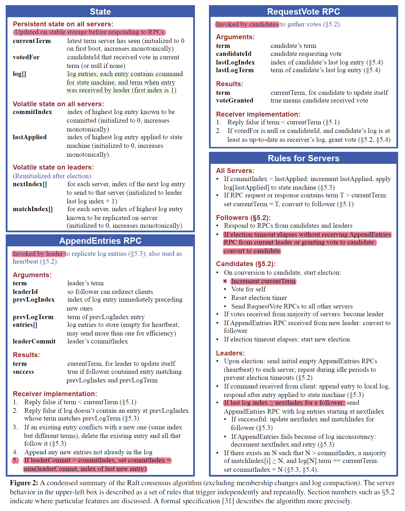
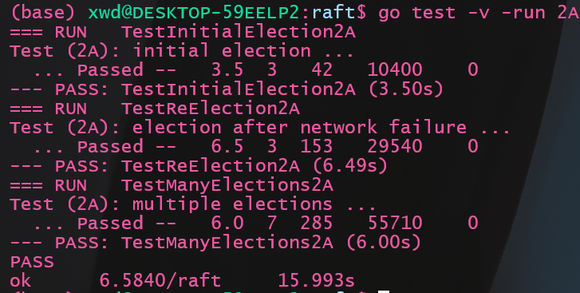

Lab2的内容是实现`Raft`算法, `Raft`算法是一种分布式系统中的一致性的共识算法, 于2014年提出。本次实现的`Raft`是下一个`K/V`实验的基础, 因此十分重要。就个人体验而言，本次实验的难度比之前的`MapReduce`复杂不少, 因此强烈建议先大致浏览一遍`Raft`的[原论文](https://pdos.csail.mit.edu/6.824/papers/raft-extended.pdf)

由于这个`Lab`难度较大, 内容较多, 我将按照文档的任务分块进行, 这一部分先介绍第一个任务: `2A: leader election`

`Lab文档`见: https://pdos.csail.mit.edu/6.824/labs/lab-raft.html

我的代码: https://github.com/GFX9/MIT6.5840/tree/lab2A

# 1 任务描述
首先贴一张原论文的图, 这张图描述了每个`RPC的逻辑, 非常重要`:



`2A`部分要求完成的是`Raft`中的`Leader选取`和`心跳函数`, 通过阅读论文和文档, 我们知道`Raft`的运行状况是这样的:
- 正常运行
  `Leader`不断发送心跳函数给`Follower`, `Follower`回复, 这个心跳是通过`AppendEntries RPC`实现的, 只不过其中`entries[]`是空的。
- 选举
  1. 当指定的心跳间隔到期时， `Follower`转化为`Candidate`并开始进行投票选举, 会为自己投票并自增`term`
  2. 每一个收到投票请求的`Server`(即包括了`Follower`, `Candidate`或旧的`Leader`), 判断其`RPC`的参数是否符合`Figure2`中的要求, 符合则投票
  3. 除非遇到了轮次更靠后的投票申请, 否则投过票的`Server`不会再进行投票
  4. 超过一半的`Server`的投票将选举出新的`Leader`, 新的`Leader`通过心跳`AppendEntries RPC`宣告自己的存在, 收到心跳的`Server`更新自己的状态
  5. 若超时时间内无新的`Leader`产生, 再进行下一轮投票, 为了避免这种情况, 应当给不同`Server`的投票超时设定随机值

# 2 代码逻辑
通过分析可知, 需要实现的功能包括:
1. 一个协程不断检测一个投票间隔内是接收到心跳或`AppendEntries RPC`(其实是一个东西), 如果没有接受到, 则发起投票
2. 处理投票的协程, 发起投票并收集投票结果以改变自身角色
3. 不断发送心跳的`Leader`的心跳发射器协程
4. 处理投票请求的`RPC`
5. 处理心跳的`RPC`

官方提供的代码里指明用`ticker`实现选举, 并给出了`RPC`的实现案例

# 3 结构体设计
第一步就是先将`Figure 2.5`的字段填入各个结构体。
## 3.1 `Raft`结构体
```go
const (
	Follower = iota
	Candidate
	Leader
)

type Entry struct {
	Term int
	Cmd  interface{}
}

type Raft struct {
	mu        sync.Mutex          // Lock to protect shared access to this peer's state
	peers     []*labrpc.ClientEnd // RPC end points of all peers
	persister *Persister          // Object to hold this peer's persisted state
	me        int                 // this peer's index into peers[]
	dead      int32               // set by Kill()

	// Your data here (2A, 2B, 2C).
	// Look at the paper's Figure 2 for a description of what
	// state a Raft server must maintain.

	currentTerm int
	votedFor    int
	log         []Entry

	commitIndex int
	lastApplied int
	nextIndex   []int
	matchIndex  []int

	// 以下不是Figure 2中的field
	timeStamp time.Time // 记录收到消息的时间(心跳或append)
	role      int

	muVote    sync.Mutex // 保护投票数据
	voteCount int
}
```
除了`Figure 2`中的字段外, 还有 `role`, `timeStamp`, `muVote`, `voteCount`四个自定义字段:
1.  `role`: 一个枚举量, 记录当前实例的角色, 取值包括: `Follower`, `Candidate`, `Leader`
2.  `voteCount`: 得票计数
3.  `muVote`: 用于保护`voteCount`的锁, 因为投票时只需要更改`voteCount`, 而全部使用`mu`明细会增加锁的竞争, 这里是细化锁的粒度
4.  `timeStamp`: 记录最后一次收到合法消息的时间戳, 每次判断是否要选举时, 通过判断与这个时间戳的差值来决定是否达到超时

**为什么不使用定时器`time.Timer`?**
主要原因是官方的`Hint`中明确表示:
>  Don't use Go's time.Timer or time.Ticker, which are difficult to use correctly.

个人实际使用后确实出现了很多不明所以的bug, 因此就选择记录时间戳`timeStamp` + `Sleep`的方式实现

## 3.2 RPC结构体
RPC结构体直接照搬`Figure 2`:
1. `RequestVote RPC`
```go
type RequestVoteArgs struct {
	// Your data here (2A, 2B).
	Term         int // candidate’s term
	CandidateId  int // candidate requesting vote
	LastLogIndex int // index of candidate’s last log entry (§5.4)
	LastLogTerm  int // term of candidate’s last log entry (§5.4)
}

// example RequestVote RPC reply structure.
// field names must start with capital letters!
type RequestVoteReply struct {
	// Your data here (2A).
	Term        int  // currentTerm, for candidate to update itself
	VoteGranted bool // true means candidate received vote
}
```
2. `AppendEntries RPC`
```go
type AppendEntriesArgs struct {
	// Your data here (2A, 2B).
	Term         int     // leader’s term
	LeaderId     int     // so follower can redirect clients
	PrevLogIndex int     // index of log entry immediately preceding new ones
	PrevLogTerm  int     // term of prevLogIndex entry
	Entries      []Entry // log entries to store (empty for heartbeat; may send more than one for efficiency)
	LeaderCommit int     // leader’s commitIndex
}

// example RequestVote RPC reply structure.
// field names must start with capital letters!
type AppendEntriesReply struct {
	// Your data here (2A).
	Term    int  // currentTerm, for leader to update itself
	Success bool // true if follower contained entry matching prevLogIndex and prevLogTerm
}
```

# 4 投票设计
## 4.1 投票发起方
1. `ticker`函数判断是否需要投票:
```go
func (rf *Raft) ticker() {
	rd := rand.New(rand.NewSource(int64(rf.me)))
	for !rf.killed() {

		// Your code here (2A)
		// Check if a leader election should be started.

		// pause for a random amount of time between 50 and 350
		// milliseconds.
		rdTimeOut := GetRandomElectTimeOut(rd)
		rf.mu.Lock()
		if rf.role != Leader && time.Since(rf.timeStamp) > time.Duration(rdTimeOut)*time.Millisecond {
			// 超时
			go rf.Elect()
		}
		rf.mu.Unlock()
		time.Sleep(ElectTimeOutCheckInterval)
	}
}
```
这里`timeStamp`就是上一次正常收到消息的时间, 判断当前的时间差再与随机获取的超时时间比较即可

另外, 根据官方的提示可知:
> You may find Go's rand useful.

确定超时间隔时, 需要为不同的`server`设置不同的种子, 否则他们大概率会同时开启选票申请, 这里我直接使用其序号`rf.me`作为随机种子。

2. `Elect`函数负责处理具体的投票任务:
```go
func (rf *Raft) Elect() {
	rf.mu.Lock()

	rf.currentTerm += 1       // 自增term
	rf.role = Candidate       // 成为候选人
	rf.votedFor = rf.me       // 给自己投票
	rf.voteCount = 1          // 自己有一票
	rf.timeStamp = time.Now() // 自己给自己投票也算一种消息

	args := &RequestVoteArgs{
		Term:         rf.currentTerm,
		CandidateId:  rf.me,
		LastLogIndex: len(rf.log) - 1,
		LastLogTerm:  rf.log[len(rf.log)-1].Term,
	}
	rf.mu.Unlock()

	for i := 0; i < len(rf.peers); i++ {
		if i == rf.me {
			continue
		}
		go rf.collectVote(i, args)
	}
}
```
这个函数的任务很简单: 
- 更新`term`
- 标记自身角色转换
- 为自己投票
- 初始化票数为1
- 更新时间戳


其余的部分很简单, 就是构造`RPC`的请求结构体, 异步地对每个`server`发起投票申请

> 易错点:
> 忘记`更新时间戳`, 因为自己给自己投票也算一种消息, 应当更新时间戳, 否则下一轮投票很快又来了

3. `collectVote`函数处理每个`server`的回复并统计票数
```go
func (rf *Raft) collectVote(serverTo int, args *RequestVoteArgs) {
	voteAnswer := rf.GetVoteAnswer(serverTo, args)
	if !voteAnswer {
		return
	}
	rf.muVote.Lock()
	if rf.voteCount > len(rf.peers)/2 {
		rf.muVote.Unlock()
		return
	}

	rf.voteCount += 1
	if rf.voteCount > len(rf.peers)/2 {
		rf.mu.Lock()
		if rf.role == Follower {
			// 有另外一个投票的协程收到了更新的term而更改了自身状态为Follower
			rf.mu.Unlock()
			rf.muVote.Unlock()
			return
		}
		rf.role = Leader
		rf.mu.Unlock()
		go rf.SendHeartBeats()
	}

	rf.muVote.Unlock()
}


func (rf *Raft) GetVoteAnswer(server int, args *RequestVoteArgs) bool {
	sendArgs := *args
	reply := RequestVoteReply{}
	ok := rf.sendRequestVote(server, &sendArgs, &reply)
	if !ok {
		return false
	}

	rf.mu.Lock()
	defer rf.mu.Unlock()

	if sendArgs.Term != rf.currentTerm {
		// 易错点: 函数调用的间隙被修改了
		return false
	}

	if reply.Term > rf.currentTerm {
		// 已经是过时的term了
		rf.currentTerm = reply.Term
		rf.votedFor = -1
		rf.role = Follower
	}
	return reply.VoteGranted
}
```
`collectVote`调用`GetVoteAnswer`, 其中`GetVoteAnswer`负责处理具体某一个`server`的回复:
1. 如果`RPC`调用失败, 直接返回
2. 如果`server`回复了更大的`term`, 表示当前这一轮的投票已经废弃, 按照回复更新`term`、自身角色和投票数据 返回`false`
3. 然后才是返回`server`是否赞成了投票

`collectVote`处理逻辑为:
1. 如果发现当前投票已经结束了(即票数过半), 返回
2. 否则按照投票结果对自身票数自增
3. 自增后如果票数过半, 检查检查状态后转换自身角色为`Leader`
4. 转换自身角色为`Leader`, 开始发送心跳

这里特别说明为什么收集投票时需要`muVote`这个锁保护`voteCount`, 因为除了最后一个超过半票的一个协程, 其余协程只需要访问`voteCount`, 因此额外设计了`muVote`这个锁保护它。

> 易错点:
> 1. 由于不同函数调用的间隙, 状态可能被别的协程改变了, 因此`GetVoteAnswer`中如果发现`sendArgs.Term != rf.currentTerm`, 表示已经有`Leader`诞生了并通过心跳改变了自己的`Term`, 所以放弃投票数据收集
> 2. `collectVote`中也存在类似的问题, 因为`collectVote`也是与`RPC心跳的handler`并发的, 可能新的`Leader`已经产生, 并通过心跳改变了自己的`role`为`Follower`, 如果不检查的话, 将导致多个`Leader`的存在
> 3. 尽管向多个`server`发送的`RequestVoteArgs`内容是相同的, 但我们不同使用同一个指针, 而是应该复制一个结构体 否则会报错, 原因暂时没看源码, 未知(先鸽了)
## 4.2 投票接收方
投票的接收方则严格按照`Figure 2`设计, 代码:
```go
// example RequestVote RPC handler.
func (rf *Raft) RequestVote(args *RequestVoteArgs, reply *RequestVoteReply) {
	// Your code here (2A, 2B).
	rf.mu.Lock()

	if args.Term < rf.currentTerm {
		// 旧的term
		// 1. Reply false if term < currentTerm (§5.1)
		reply.Term = rf.currentTerm
		rf.mu.Unlock()
		reply.VoteGranted = false
		DPrintf("server %v 拒绝向 server %v投票: 旧的term: %v,\n\targs= %+v\n", rf.me, args.CandidateId, args.Term, args)
		return
	}

	// 代码到这里时, args.Term >= rf.currentTerm

	if args.Term > rf.currentTerm {
		// 已经是新一轮的term, 之前的投票记录作废
		rf.votedFor = -1
	}

	// at least as up-to-date as receiver’s log, grant vote (§5.2, §5.4)
	if rf.votedFor == -1 || rf.votedFor == args.CandidateId {
		// 首先确保是没投过票的
		if args.Term > rf.currentTerm ||
			(args.LastLogIndex >= len(rf.log)-1 && args.LastLogTerm >= rf.log[len(rf.log)-1].Term) {
			// 2. If votedFor is null or candidateId, and candidate’s log is least as up-to-date as receiver’s log, grant vote (§5.2, §5.4)
			rf.currentTerm = args.Term
			reply.Term = rf.currentTerm
			rf.votedFor = args.CandidateId
			rf.role = Follower
			rf.timeStamp = time.Now()

			rf.mu.Unlock()
			reply.VoteGranted = true
			DPrintf("server %v 同意向 server %v投票\n\targs= %+v\n", rf.me, args.CandidateId, args)
			return
		}
	} else {
		DPrintf("server %v 拒绝向 server %v投票: 已投票\n\targs= %+v\n", rf.me, args.CandidateId, args)
	}

	reply.Term = rf.currentTerm
	rf.mu.Unlock()
	reply.VoteGranted = false
}
```
代码的逻辑是(对`Figure 2 `做了一定自己理解的展开):
1. 如果`args.Term < rf.currentTerm`, 直接拒绝投票, 并告知更新的投票
2. 如果`args.Term > rf.currentTerm`, 更新`rf.votedFor = -1`, 表示自己没有投票, 之前轮次的投票作废
3. 如果满足下面两个情况之一, 投票, 然后更新`currentTerm`, `votedFor`,`role`, `timeStamp `
   1. `args.Term > rf.currentTerm`
   2. `term == currentTerm`且`LastLogTerm`和`LastLogIndex`位置的条目存在且`term`合法, 并且未投票或者投票对象是自己
4. 其他情况不投票

> 易错点
> `args.Term > rf.currentTerm`的情况需要设置`rf.votedFor = -1`, 因为当前的`server`可能在正处于旧的`term`的选举中,并投给了别人, 应当废除旧`term`的投票, 将其置为未投票的状态, 否则将错失应有的投票


# 5 心跳设计(`AppendEntries RPC`)
## 5.1 心跳发射器
当一个`Leader`诞生时, 立即启动心跳发射器, 其不断地调用`AppendEntries RPC`, 只是`Entries`是空的而已, 其代码相对简单:
```go
func (rf *Raft) SendHeartBeats() {
	DPrintf("server %v 开始发送心跳\n", rf.me)

	for !rf.killed() {
		rf.mu.Lock()
		// if the server is dead or is not the leader, just return
		if rf.role != Leader {
			rf.mu.Unlock()
			// 不是leader则终止心跳的发送
			return
		}
		args := &AppendEntriesArgs{
			Term:         rf.currentTerm,
			LeaderId:     rf.me,
			PrevLogIndex: 0,
			PrevLogTerm:  0,
			Entries:      nil,
			LeaderCommit: rf.commitIndex,
		}
		rf.mu.Unlock()

		for i := 0; i < len(rf.peers); i++ {
            if i == rf.me {
				continue
			}
			go rf.handleHeartBeat(i, args)
		}

		time.Sleep(time.Duration(HeartBeatTimeOut) * time.Millisecond)
	}
}
```
> 易错点:
> 同前文描述, 尽管向多个`server`发送的`AppendEntriesArgs`内容是相同的, 但我们不能使用同一个指针, 而是应该复制一个结构体 否则会报错

```go
func (rf *Raft) handleHeartBeat(serverTo int, args *AppendEntriesArgs) {
	reply := &AppendEntriesReply{}
	sendArgs := *args // 复制一份args结构体, (可能有未知的错误)
	ok := rf.sendAppendEntries(serverTo, &sendArgs, reply)

	if !ok {
		return
	}

	rf.mu.Lock()
	defer rf.mu.Unlock()
	if sendArgs.Term != rf.currentTerm {
		// 函数调用间隙值变了
		return
	}

	if reply.Term > rf.currentTerm {
		DPrintf("server %v 旧的leader收到了心跳函数中更新的term: %v, 转化为Follower\n", rf.me, reply.Term)
		rf.currentTerm = reply.Term
		rf.votedFor = -1
		rf.role = Follower
	}
}
```
`handleHeartBeat`负责处理每一个发出的心跳函数的回复, 只需要考虑的就是自身的`term`被更新了, 需要更改自身状态, 其逻辑和前文相同, 不赘述

> 易错点
> 这里也存在函数调用间隙字段被修改的情况, 也需要检查`sendArgs.Term != rf.currentTerm`的情况


## 5.2 心跳接受方
心跳接受方实际上就是`AppendEntries RPC`的`handler`, 由于目前日志部分的字段还没有设计, 因此这里的代码不涉及持久化:
```go
func (rf *Raft) AppendEntries(args *AppendEntriesArgs, reply *AppendEntriesReply) {
	// Your code here (2A, 2B).
	// 新leader发送的第一个消息
	rf.mu.Lock()

	if args.Term < rf.currentTerm {
		// 这是来自旧的leader的消息
		// 1. Reply false if term < currentTerm (§5.1)
		reply.Term = rf.currentTerm
		rf.mu.Unlock()
		reply.Success = false
		return
	}

	// 代码执行到这里就是 args.Term >= rf.currentTerm 的情况

	// 不是旧 leader的话需要记录访问时间
	rf.timeStamp = time.Now()

	if args.Term > rf.currentTerm {
		// 新leader的第一个消息
		rf.currentTerm = args.Term // 更新iterm
		rf.votedFor = -1           // 易错点: 更新投票记录为未投票
		rf.role = Follower
	}

	if args.Entries == nil {
		// 心跳函数
		DPrintf("server %v 接收到 leader &%v 的心跳\n", rf.me, args.LeaderId)
	}
	if args.Entries != nil &&
		(args.PrevLogIndex >= len(rf.log) || rf.log[args.PrevLogIndex].Term != args.PrevLogTerm) {
		// 校验PrevLogIndex和PrevLogTerm不合法
		// 2. Reply false if log doesn’t contain an entry at prevLogIndex whose term matches prevLogTerm (§5.3)

		reply.Term = rf.currentTerm
		rf.mu.Unlock()
		reply.Success = false
		return
	}
	// 3. If an existing entry conflicts with a new one (same index
	// but different terms), delete the existing entry and all that
	// follow it (§5.3)
	// 4. Append any new entries not already in the log
	// TODO: 补充apeend的业务

	reply.Success = true
	reply.Term = rf.currentTerm

	if args.LeaderCommit > rf.commitIndex {
		// 5.If leaderCommit > commitIndex, set commitIndex = min(leaderCommit, index of last new entry)
		rf.commitIndex = int(math.Min(float64(args.LeaderCommit), float64(len(rf.log)-1)))
	}
	rf.mu.Unlock()
}`
```
`AppendEntries`严格按照`Figure 2`实现:
1. 如果`term < currentTerm`表示这是一个旧`leader`的消息, 告知其更新的`term`并返回`false`
2. 如果自己的日志中`prevLogIndex`处不存在有效的日志, 或者与`prevLogTerm`不匹配, 返回`false`
3. 如果现存的日志与请求的信息冲突, 删除冲突的日志(这一部分不涉及)
4. 添加日志(这一部分不涉及)
5. 如果`leaderCommit > commitIndex`, 确认者较小值并更新

同时, 收到`AppendEntries`需要更新对应的时间戳`rf.timeStamp`

> 易错点
> 1. 如果`args.Term > rf.currentTerm`, 表示这是新的`Leader`发送的消息, 由于自身可能正在进行选举投票, 因此需要更改`rf.role = Followe && rf.votedFor = -1`以终止其不应该继续的投票, 同时更新`rf.votedFor = -1`, `-1`表示未投过票。

# 6 测试
## 6.1 常规测试
执行测试命令
```bash
go test -v -run 2A
```
结果如下:



## 6.2 多次测试
`raft`的许多特性导致其一次测试并不准确, 有些bug需要多次测试才会出现, 编写如下脚本命名为`manyTest_2A.sh`:
```shell
#!/bin/bash

# 初始化计数器
count=0
success_count=0
fail_count=0

# 设置测试次数
max_tests=50

for ((i=1; i<=max_tests; i++))
do
    echo "Running test iteration $i of $max_tests..."

    # 运行 go 测试命令
    go test -v -run 2A &> output.log

    # 检查 go 命令的退出状态
    if [ "$?" -eq 0 ]; then
        # 测试成功
        success_count=$((success_count+1))
        echo "Test iteration $i passed."
        # 如果想保存通过的测试日志，取消下面行的注释
        # mv output.log "success_$i.log"
    else
        # 测试失败
        fail_count=$((fail_count+1))
        echo "Test iteration $i failed, check 'failure_$i.log' for details."
        mv output.log "failure_$i.log"
    fi
done

# 报告测试结果
echo "Testing completed: $max_tests iterations run."
echo "Successes: $success_count"
echo "Failures: $fail_count"
```
再次进行测试:
```bash
./manyTest_2A.sh
```
结果:


# 更新
代码在`leader`选举过程中存在`bug`, 但任然能通过测例, 修复后的代码和`bug`分析见 下一篇文章: [Lab2_Raft_2B.md](/2024/01/06/MIT6.5840/Lab2_Raft_2B/)