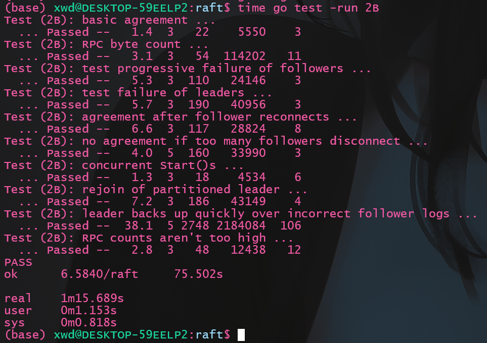
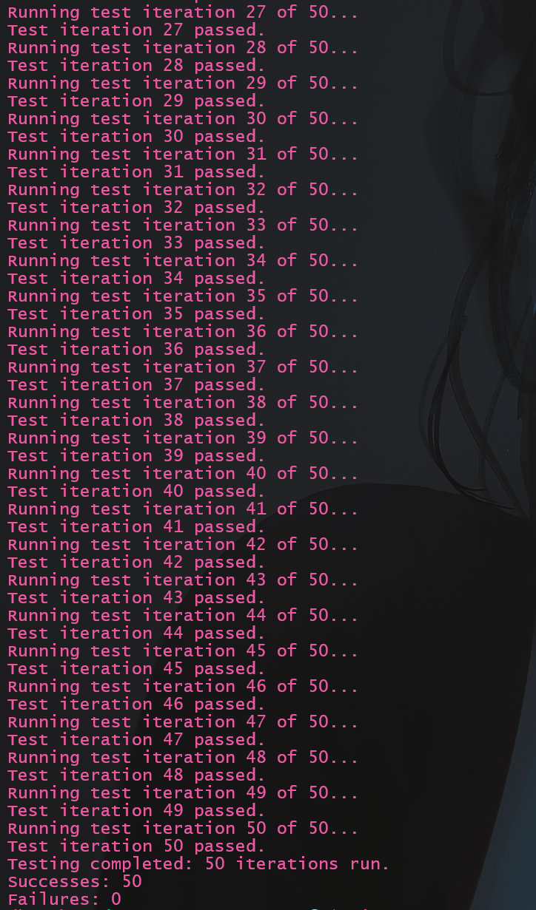
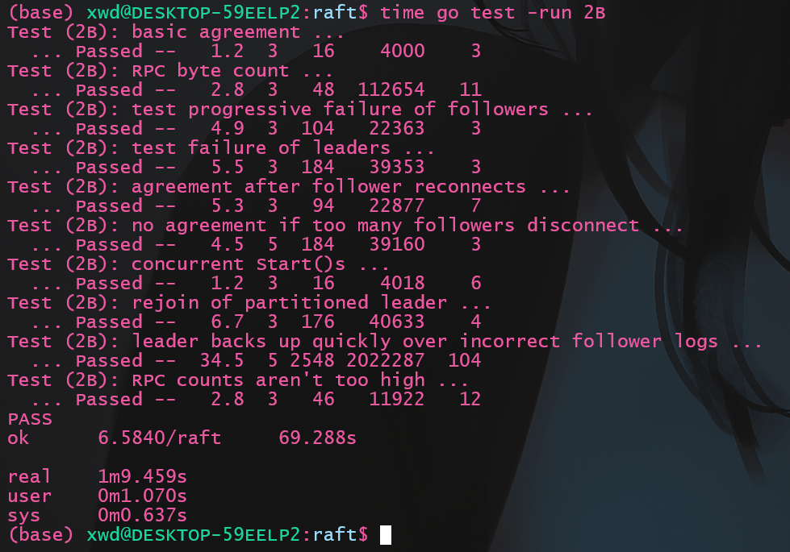

本文将介绍`lab2B`部分的实现, `lab2B`要求实现`raft`中的日志复制和提交两部分的内容, 相比`lab2A`, `lab2B`的`Hint`更少, 难度也相对较大。

`Lab文档`见: https://pdos.csail.mit.edu/6.824/labs/lab-raft.html

我的2A部分的实现在[这里](/2024/01/01/MIT6.8540/Lab2_Raft_2A/) 

[raft原论文](https://pdos.csail.mit.edu/6.824/papers/raft-extended.pdf)

我的代码:
- 时间戳实现: https://github.com/ToniXWD/MIT6.8540/tree/lab2B
- timer实现: https://github.com/ToniXWD/MIT6.8540/tree/lab2B-timer

# 1 2A部分的bug修复
## 1.1 修复孤立节点被选举的bug
- **问题追溯**
`2A`部分中, `RequestVote`中允许投票的判断我的实现是这样的:
```go
if rf.votedFor == -1 || rf.votedFor == args.CandidateId {
    // 首先确保是没投过票的
    if args.Term > rf.currentTerm ||
        (args.LastLogIndex >= len(rf.log)-1 && args.LastLogTerm >= rf.log[len(rf.log)-1].Term) {
        ...
    }
}
```
在调试`2B`的时候, 遇到了已经`committed`的信息丢失的问题, 问题就在于上述的代码, 其判断统一投票的逻辑为:
1. 首先要求其没有投过票或者投票对象就是这个`RPC`请求发起者
2. 如果`args.Term > rf.currentTerm`投票, 也就是投票者有更新的`term`
3. 如果`term`相同, 则只有请求者的`log`至少和自己一样长, 并且`LastLogTerm `也至少和自己的最后一个`log`的`term`一样新, 才投票

这样的实现会导致以下的情况:
1. 某一时刻一个`server`网络出现了问题(称其为`S`), 其自增`currentTerm`后发出选举， 经过多次选举超时后其`currentTerm`已经远大于离开集群时的`currentTerm`
2. 后来网络恢复了正常, 这时其他的服务器收到了`S`的选举请求, 这个选举请求有更新的term, 因此都同意向它投票, `S`成为了最新的`leader`
3. 由于`S`离开集群时集群其他的服务器已经提交了多个`log`, 这些提交在`S`中不存在, 而`S`信任自己的`log`, 并将自己的`log`复制到所有的`follower`上, 这将覆盖已经提交了多个`log`, 导致了错误

- **bug修改**
因此, 重新审视`raft`论文中`Figure 2`的描述:
> Receiver implementation:
> 1. Reply false if term < currentTerm (§5.1)
> 2. If votedFor is null or candidateId, and candidate’s log is at least as up-to-date as receiver’s log, grant vote (§5.2, §5.4)

这里的日志至少一样新指的并不是`raft`结构体中的`currentTerm`, 而是指的`log`中最后一项的`Term`, 因此需要将`if`判断条件修改为:
```go
if rf.votedFor == -1 || rf.votedFor == args.CandidateId {
    // 首先确保是没投过票的
    if args.LastLogTerm > rf.log[len(rf.log)-1].Term ||
        (args.LastLogTerm == rf.log[len(rf.log)-1].Term && args.LastLogIndex >= len(rf.log)-1) {
        ...
    }
}
```

*PS: 为什么这么显眼的错误能通过`2A`的测例...*

## 1.2 修复`currentTerm`的追赶问题
还是`RequestVote`中的bug:
```go
if args.Term > rf.currentTerm {
    // 已经是新一轮的term, 之前的投票记录作废
    rf.votedFor = -1
}
```
这里在收到其他节点的投票申请后, 如果当前的`Term`更小, 则撤销以前任期的投票记录, 改为未投票, 这将导致后续的`if`判断满足第一个投票条件: `首先要求其没有投过票或者投票对象就是这个RPC请求发起者`, 但除了撤销以前任期的投票记录外, 还应该将自身转化为`Follower`, 同时直接将`Term`更新到`args.Term`

为什么之前的实现忽略了这些呢? 因为在之前的实现中, 预想中的角色的转化是发生在接受到心跳后。换言之， 需要等待新的`leader`产生后通过心跳函数来完成之前在`RequestVote`中出现`args.Term > rf.currentTerm`的节点的角色转换, 但是问题在于可能存在**孤立节点**, 因为**孤立节点**的`log`中的最后一项的`Term`很小, 但由于多次的选举超时, 其`currentTerm`很大, 而新的`leader`产生后通过心跳函数来完成某个节点角色切换为`follower`的前提是`term`更大*, 因此如果**孤立节点**的`currentTerm`很大, 需要新的`leader`经过非常多次的选举, 因为每次选举自增的`currentTerm`为1, 这将导致很长且并不要的时间消耗

所以, 修改过后的代码为:
```go
if args.Term > rf.currentTerm {
    // 已经是新一轮的term, 之前的投票记录作废
    rf.votedFor = -1
    rf.currentTerm = args.Term // 易错点, 需要将currentTerm提升到最新的term
    rf.role = Follower
}
```

# 2 论文解读: 日志复制和commit部分
日志复制的逻辑如下:
- **`leader`视角**
1. `client`想集群的一个节点发送的命令, 如果不是`leader`, `follower`会通过心跳得知`leader`并返回给`client`
2. `leader`收到了命令, 将其构造为一个日志项, 添加当前节点的`currentTerm`为日志项的`Term`, 并将其追加到自己的`log`中
3. `leader`发送`AppendEntries RPC`将`log`复制到所有的节点, `AppendEntries RPC`需要增加`PrevLogIndex`、`PrevLogTerm`以供`follower`校验, 其中`PrevLogIndex`、`PrevLogTerm`由`nextIndex`确定
4. 如果`RPC`返回了成功, 则更新`matchIndex`和`nextIndex`, 同时寻找一个满足过半的`matchIndex[i] >= N`的索引位置`N`, 将其更新为自己的`commitIndex`, 并提交直到`commitIndex`部分的日志项
5. 如果`RPC`返回了失败, 且伴随的的`Term`更大, 表示自己已经不是`leader`了, 将自身的角色转换为`Follower`, 并更新`currentTerm`和`votedFor`, 重启计时器
6. 如果`RPC`返回了失败, 且伴随的的`Term`和自己的`currentTerm`相同, 将`nextIndex`自减再重试

- **`follower`视角**
1. `follower`收到`AppendEntries RPC`后,`currentTerm`不匹配直接告知更新的`Term`, 并返回`false`
2. `follower`收到`AppendEntries RPC`后, 通过`PrevLogIndex`、`PrevLogTerm`可以判断出"`leader`认为自己`log`的结尾位置"是否存在并且`Term`匹配, 如果不匹配, 返回`false`并不执行操作;
3. 如果上述位置的信息匹配, 则需要判断插入位置是否有旧的日志项, 如果有, 则向后将`log`中冲突的内容清除
4. 将`RPC`中的日志项追加到`log`中
5. 根据`RPC`的传入参数更新`commitIndex`, 并提交直到`commitIndex`部分的日志项

# 3 设计思路
## 3.1 心跳和`AppendEntries`的区别?
根据`2A`的内容可知, 心跳就是一种特殊的`AppendEntries`, 其特殊在`Entries`长度为0, 并且有论文可知
> • If last log index ≥ nextIndex for a follower: send AppendEntries RPC with log entries starting at nextIndex
> • If successful: update nextIndex and matchIndex for follower (§5.3)
> • If AppendEntries fails because of log inconsistency: decrement nextIndex and retry (§5.3)

`AppendEntries`除了`PRC`失败的情况下, 会一直重试, 直到返回`true`, 那么如果我们单独创建一个协程用于发送真正的不为心跳的`AppendEntries`, 需要考虑如下的问题:
1. 重试是应该立即重试, 还是设置一个重置超时?
2. 何时触发这个处理`AppendEntries`的协程? 是累计了多个个日志项后再出发处理协程? 还是一旦有一个日志项就触发?
3. 发射心跳处理函数时也会附带`PrevLogIndex`和`PrevLogTerm`以供`follower`验证, 心跳函数的这些参数会不会和之前的`AppendEntries`冲突? `follower`端如何处理这些重复的内容?

看完上述几点, 我们可以看出, 如果将`AppendEntries`和心跳的发射器分开实现, 会增加代码的复杂度, 同时`AppendEntries`也具有重复发送的特点, 这和心跳的特点完美契合, 因此, 我们得出如下结论: **`AppendEntries`可以和心跳公用同一个发射器**

## 3.2 结构体参数解读
首先`raft`结构体会新增几个`2A`中没有使用过的成员, 解释如下:
```go
type Raft struct {
    ...
	nextIndex  []int // 复制到某一个follower时, log开始的索引
	matchIndex []int // 已经被复制到follower的日志的最高索引
	commitIndex int  // 将要提交的日志的最高索引
	lastApplied int  // 已经被应用到状态机的日志的最高索引
	applyCh     chan ApplyMsg // 用于在应用到状态机时传递消息
}
```
因此, 发送心跳或者`AppendEntries`时, `AppendEntriesArgs`应如下构造:
```go
args := &AppendEntriesArgs{
				Term:         rf.currentTerm,
				LeaderId:     rf.me,
				PrevLogIndex: rf.nextIndex[i] - 1,
				PrevLogTerm:  rf.log[rf.nextIndex[i]-1].Term,
				LeaderCommit: rf.commitIndex,
}
if len(rf.log)-1 >= rf.nextIndex[i] {
    // 如果有新的log需要发送, 则就是一个真正的AppendEntries而不是心跳
    args.Entries = rf.log[rf.nextIndex[i]:]
    DPrintf("leader %v 开始向 server %v 广播新的AppendEntries\n", rf.me, i)
} else {
    // 如果没有新的log发送, 就发送一个长度为0的切片, 表示心跳
    args.Entries = make([]Entry, 0)
    DPrintf("leader %v 开始向 server %v 广播新的心跳, args = %+v \n", rf.me, i, args)
}
```

**PS: 术语补充**
1. `commited`: 集群中半数节点都已经复制了日志, 这保证了这个日志即使在重新选举后仍然存在, 因为不存在`commited`日志项的节点不会被选举
2. `applied`: 指日志项的内容已经被应用到状态机

## 3.3 代码架构分析
1. 由于`AppendEntries`和心跳公用同一个发射器(此后就称为心跳发射), 因此`leader`只需要将从`client`接收的心得日志项追加到`log`中即可, 发射器在每次超时到达后, 从每个`nextIndex[i]`构造`Entries`切片, 如果切片长度为0就是心跳, 不需要显式地判断是心跳或者是真的`AppendEntries`。
2. 处理每个`AppendEntrie RPC`回复的函数只需要调整`nextIndex`和`matchIndex`即可, 下次心跳发送时会自动更新切片的长度。
3. 处理每个`AppendEntrie RPC`回复的函数还需要找到`N`以更新`commitIndex`并唤醒**应用到状态机的协程**(这个协程也可以是`Sleep` + 轮训的方式实现)
4. 由于`AppendEntries`也会附带上一次跳发射的回复处理中可能被更新的`commitIndex`, 因此`follower`端也会根据`commitIndex`唤醒自己的**应用到状态机的协程**(这个协程也可以是`Sleep` + 轮训的方式实现)

# 4 代码实现
## 4.1 修改后的发射器
```go
func (rf *Raft) SendHeartBeats() {
	// 2B相对2A的变化, 真实的AppendEntries也通过心跳发送
	DPrintf("leader %v 开始发送心跳\n", rf.me)

	for !rf.killed() {
		rf.mu.Lock()
		// if the server is dead or is not the leader, just return
		if rf.role != Leader {
			rf.mu.Unlock()
			// 不是leader则终止心跳的发送
			return
		}

		for i := 0; i < len(rf.peers); i++ {
			if i == rf.me {
				continue
			}
			args := &AppendEntriesArgs{
				Term:         rf.currentTerm,
				LeaderId:     rf.me,
				PrevLogIndex: rf.nextIndex[i] - 1,
				PrevLogTerm:  rf.log[rf.nextIndex[i]-1].Term,
				LeaderCommit: rf.commitIndex,
			}
			if len(rf.log)-1 >= rf.nextIndex[i] {
				// 如果有新的log需要发送, 则就是一个真正的AppendEntries而不是心跳
				args.Entries = rf.log[rf.nextIndex[i]:]
				DPrintf("leader %v 开始向 server %v 广播新的AppendEntries\n", rf.me, i)
			} else {
				// 如果没有新的log发送, 就发送一个长度为0的切片, 表示心跳
				args.Entries = make([]Entry, 0)
				DPrintf("leader %v 开始向 server %v 广播新的心跳, args = %+v \n", rf.me, i, args)
			}
			go rf.handleAppendEntries(i, args)
		}

		rf.mu.Unlock()

		time.Sleep(time.Duration(HeartBeatTimeOut) * time.Millisecond)
	}
}
```
与之前的区别就是为每个发送的`follower`单独构建了`AppendEntriesArgs`, 代码整体很简单, 几乎没啥区别

## 4.2 `AppendEntries handler`
```go
func (rf *Raft) handleAppendEntries(serverTo int, args *AppendEntriesArgs) {
	// 目前的设计, 重试自动发生在下一次心跳函数, 所以这里不需要死循环

	// for {
	reply := &AppendEntriesReply{}
	ok := rf.sendAppendEntries(serverTo, args, reply)
	if !ok {
		return
	}

	rf.mu.Lock()

	if args.Term != rf.currentTerm {
		// 函数调用间隙值变了, 已经不是发起这个调用时的term了
		// 要先判断term是否改变, 否则后续的更改matchIndex等是不安全的
		rf.mu.Unlock()
		return
	}

	if reply.Success {
		// server回复成功
		rf.matchIndex[serverTo] = args.PrevLogIndex + len(args.Entries)
		rf.nextIndex[serverTo] = rf.matchIndex[serverTo] + 1

		// 需要判断是否可以commit
		N := len(rf.log) - 1

		for N > rf.commitIndex {
			count := 1 // 1表示包括了leader自己
			for i := 0; i < len(rf.peers); i++ {
				if i == rf.me {
					continue
				}
				if rf.matchIndex[i] >= N && rf.log[N].Term == rf.currentTerm {
					count += 1
				}
			}
			if count > len(rf.peers)/2 {
				// 如果至少一半的follower回复了成功, 更新commitIndex
				rf.commitIndex = N
				break
			}
			N -= 1
		}

		rf.mu.Unlock()
		return
	}

	if reply.Term > rf.currentTerm {
		// 回复了更新的term, 表示自己已经不是leader了
		DPrintf("server %v 旧的leader收到了来自 server % v 的心跳函数中更新的term: %v, 转化为Follower\n", rf.me, serverTo, reply.Term)

		rf.currentTerm = reply.Term
		rf.role = Follower
		rf.votedFor = -1
		rf.timeStamp = time.Now()
		rf.mu.Unlock()
		return
	}

	if reply.Term == rf.currentTerm && rf.role == Leader {
		// term仍然相同, 且自己还是leader, 表名对应的follower在prevLogIndex位置没有与prevLogTerm匹配的项
		// 将nextIndex自减再重试
		rf.nextIndex[serverTo] -= 1
		rf.mu.Unlock()
		// time.Sleep(RetryTimeOut)
		// continue
		return
	}
	// }
}
```
这里做出了如下几个修改:
1. 回复成功后, 添加了确定`N`的代码, 并判断是否更新`commitIndex`, 由于这里采取的**应用到状态机的协程**使用的是`Sleep`+轮训的方式, 因此没有别的操作, 如果采用条件变量, 还需要唤醒条件变量
2. 如果返回`false`但`term`相同, 表明对应的`follower`在`prevLogIndex`位置没有与`prevLogTerm`匹配的项或者不存在`prevLogIndex`, 将`nextIndex`自减, 下一次发射器会重试

## 4.3 `AppendEntries RPC`
```go
// AppendEntries handler
func (rf *Raft) AppendEntries(args *AppendEntriesArgs, reply *AppendEntriesReply) {
	...
    // 之前的代码与2A相同

	if len(args.Entries) == 0 {
		// 心跳函数
		DPrintf("server %v 接收到 leader %v 的心跳: %+v\n", rf.me, args.LeaderId, args)
	} else {
		DPrintf("server %v 收到 leader %v 的的AppendEntries: %+v \n", rf.me, args.LeaderId, args)
	}

	if args.PrevLogIndex >= len(rf.log) || rf.log[args.PrevLogIndex].Term != args.PrevLogTerm {
		// 校验PrevLogIndex和PrevLogTerm不合法
		// 2. Reply false if log doesn’t contain an entry at prevLogIndex whose term matches prevLogTerm (§5.3)
		reply.Term = rf.currentTerm
		rf.mu.Unlock()
		reply.Success = false
		DPrintf("server %v 检查到心跳中参数不合法:\n\t args.PrevLogIndex=%v, args.PrevLogTerm=%v, \n\tlen(self.log)=%v, self最后一个位置term为:%v\n", rf.me, args.PrevLogIndex, args.PrevLogTerm, len(rf.log), rf.log[len(rf.log)-1].Term)
		return
	}
	// 3. If an existing entry conflicts with a new one (same index
	// but different terms), delete the existing entry and all that
	// follow it (§5.3)
	if len(args.Entries) != 0 && len(rf.log) > args.PrevLogIndex+1 && rf.log[args.PrevLogIndex+1].Term != args.Entries[0].Term {
		// 发生了冲突, 移除冲突位置开始后面所有的内容
		DPrintf("server %v 的log与args发生冲突, 进行移除\n", rf.me)
		rf.log = rf.log[:args.PrevLogIndex+1]
	}
	// 4. Append any new entries not already in the log
	// 补充apeend的业务
	rf.log = append(rf.log, args.Entries...)
	if len(args.Entries) != 0 {
		// DPrintf("server %v 成功进行apeend, log: %+v\n", rf.me, rf.log)
		DPrintf("server %v 成功进行apeend\n", rf.me)
	}

	reply.Success = true
	reply.Term = rf.currentTerm
	if args.LeaderCommit > rf.commitIndex {
		// 5.If leaderCommit > commitIndex, set commitIndex = min(leaderCommit, index of last new entry)
		rf.commitIndex = int(math.Min(float64(args.LeaderCommit), float64(len(rf.log)-1)))
	}
	rf.mu.Unlock()
}
```

这里的改动主要是增加了具体的`append`业务, 架构与之前变化不大, 需要注意的是, 如果采用条件变量实现**应用到状态机的协程**, 还需要唤醒条件变量。

## 4.4 `Start`函数
`Start`函数只是将`command`追加到自己的`log`中, 因此其不保证`command`一定会提交。 其不需要调用任何其他的协程， 因此心跳函数是周期性自动检测的。
```go
func (rf *Raft) Start(command interface{}) (int, int, bool) {
	// 如果不是leader返回false
	rf.mu.Lock()
	defer rf.mu.Unlock()
	if rf.role != Leader {
		return -1, -1, false
	}

	newEntry := &Entry{Term: rf.currentTerm, Cmd: command}
	rf.log = append(rf.log, *newEntry)

	return len(rf.log) - 1, rf.currentTerm, true
}
```

## 4.5 应用到状态机的协程
`CommitChecker`也是一个轮询的协程, 也可以使用条件变量来实现, 其不断检查`rf.commitIndex > rf.lastApplied`, 将`rf.lastApplied`递增然后发送到管道`applyCh `。
```go
func (rf *Raft) CommitChecker() {
	// 检查是否有新的commit
	for !rf.killed() {
		rf.mu.Lock()
		for rf.commitIndex > rf.lastApplied {
			rf.lastApplied += 1
			msg := &ApplyMsg{
				CommandValid: true,
				Command:      rf.log[rf.lastApplied].Cmd,
				CommandIndex: rf.lastApplied,
			}
			rf.applyCh <- *msg
			DPrintf("server %v 准备将命令 %v(索引为 %v ) 应用到状态机\n", rf.me, msg.Command, msg.CommandIndex)
		}
		rf.mu.Unlock()
		time.Sleep(CommitCheckTimeInterval)
	}
}
```

## 4.6 修改选举函数
由于`nextIndex[]`和`matchIndex[]`是易失性数据, 每次重新选出`leader`后需要重新初始化, 因此对`collectVote`修改如下:
```go
func (rf *Raft) collectVote(serverTo int, args *RequestVoteArgs) {
	...
	if rf.voteCount > len(rf.peers)/2 {
		...
		rf.role = Leader
		// 需要重新初始化nextIndex和matchIndex
		for i := 0; i < len(rf.nextIndex); i++ {
			rf.nextIndex[i] = len(rf.log)
			rf.matchIndex[i] = 0
		}
		...
	}

	rf.muVote.Unlock()
}
```

# 5 测试
## 5.1 常规测试
执行测试命令
```bash
go test -v -run 2B
```
结果如下:



## 5.2 多次测试
`raft`的许多特性导致其一次测试并不准确, 有些bug需要多次测试才会出现, 编写如下脚本命名为`manyTest_2B.sh`:
```shell
#!/bin/bash

# 初始化计数器
count=0
success_count=0
fail_count=0

# 设置测试次数
max_tests=50

for ((i=1; i<=max_tests; i++))
do
    echo "Running test iteration $i of $max_tests..."

    # 运行 go 测试命令
    go test -v -run 2B &> output.log

    # 检查 go 命令的退出状态
    if [ "$?" -eq 0 ]; then
        # 测试成功
        success_count=$((success_count+1))
        echo "Test iteration $i passed."
        # 如果想保存通过的测试日志，取消下面行的注释
        # mv output.log "success_$i.log"
    else
        # 测试失败
        fail_count=$((fail_count+1))
        echo "Test iteration $i failed, check 'failure_$i.log' for details."
        mv output.log "failure_$i.log"
    fi
done

# 报告测试结果
echo "Testing completed: $max_tests iterations run."
echo "Successes: $success_count"
echo "Failures: $fail_count"
```
再次进行测试:
```bash
./manyTest_2B.sh
```
结果:



# 6 代码优化
代码优化的初衷是看到了官网的描述:
> The "ok 6.5840/raft 35.557s" means that Go measured the time taken for the 2B tests to be 35.557 seconds of real (wall-clock) time. The "user 0m2.556s" means that the code consumed 2.556 seconds of CPU time, or time spent actually executing instructions (rather than waiting or sleeping). If your solution uses much more than a minute of real time for the 2B tests, or much more than 5 seconds of CPU time, you may run into trouble later on. Look for time spent sleeping or waiting for RPC timeouts, loops that run without sleeping or waiting for conditions or channel messages, or large numbers of RPCs sent.

我之前的时间花了`75.5s`, 因此准备优化, 不过优化后发现也没多大改善, 主要原因是没有实现**快速回退**, 目前回退是一个一个的, 当然慢, 不过这个是`2C`的后话了

- **优化1: 使用条件变量**
将`CommitChecker`改为条件变量控制而不是轮询, 这里就不贴代码了, 很简单
- **优化1: 使用timer**
尽管课程不推荐**timer**, 但`ticker`如果是轮训的话, 应该是不如定时器快的, 因此试了下定时器的实现
这里也不贴代码了, 很简单

优化后再次测试:



快了`6s`, 有一定程度提升, 但倒数第二个测试
`Test (2B): leader backs up quickly over incorrect follower logs ...`
还是很慢, 应该是暂时还没实现快速回退的原因