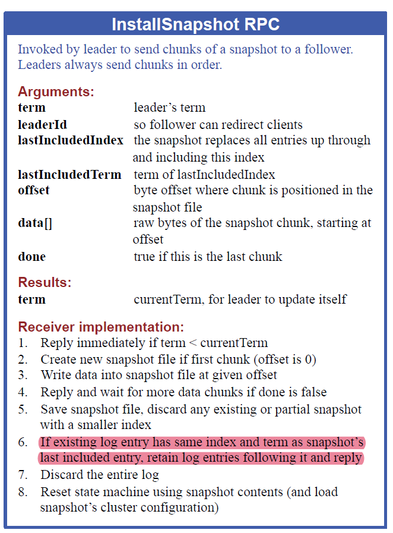
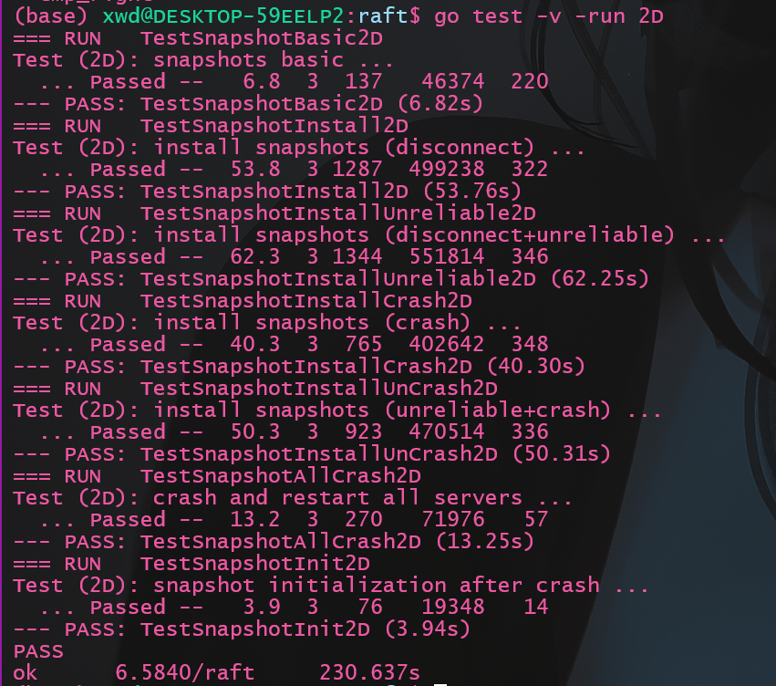
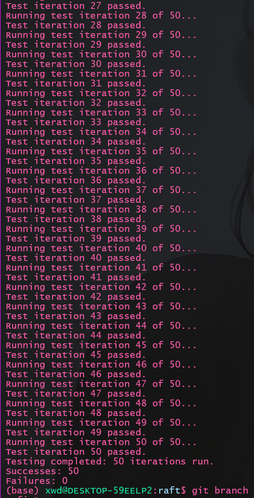

本文将介绍`lab2D`部分的实现, `lab2D`要求实现`raft`中的快照功能。从个人体验而言, `lab2D`是目前所有`Lab`中最难的一个, 各种边界情况层出不穷, `debug`时看着上千行的`debug`日志, 一度感到绝望...好在反复调试后终于实现了`raft`, 还是有点小感动☺️

主要难度在于:
1. 将日志数组截断后, 需要实现全局索引和数组索引之前的转化, 需要考虑更多数组越界的边界条件
2. 在接收`InstallSnapshot RPC`安装快照后, `lastApplied`可能已经落后于快照产生时的日志索引, 是无效的日志项, 不应该被应用
3. 由于安装快照后, `Leader`的`nextIndex`在回退时可能出现索引越界, 需要考虑边界情况

个人体会是, 本`Lab`的核心技能是: **一定要学会从日志输出中诊断问题!!!**

`Lab文档`见: https://pdos.csail.mit.edu/6.824/labs/lab-raft.html

我的代码: https://github.com/ToniXWD/MIT6.5840/tree/lab2D

# 1 代码层级关系梳理
我们需要实现的`SnapShot`是在`raft`之上的`service`层提供的, 因为`raft`层并不理解所谓的`状态机`内部状态的机制, 因此有必要了解整个代码的层次结构:


官方的指导书贴心地给出了代码层级的和接口的示意图, 如上。
`service`与`raft`的交互逻辑如下：
1. 日志复制与应用
具体的`service`, 如`Lab3`中将实现的KV存储, 位于`raft`层之上, 通过`Start`发送命令给`Leader`一侧的`raft`层, `Leader raft`会将日志项复制给集群内的其他`Follower raft`, `Follower raft`通过`applyCh`这个管道将已经提交的包含命令的日志项向上发送给`Follower`侧的`service`。
2. 快照请求与传输
某一时刻， `service`为了减小内存压力，将`状态机状态`封装成一个`SnapShot`并将请求发送给`Leader`一侧的`raft`(`Follower`侧的`sevice`也会会存在快照操作), `raft`层保存`SnapShot`并截断自己的`log`数组, 当通过心跳发现`Follower`的节点的`log`落后`SnapShot`时, 通过`InstallSnapshot`发送给`Follower`, `Follower`保存`SnapShot`并将快照发送给`service`
3. 持久化存储
`raft`之下还存在一个持久化层`Persistent Storage`, 也就是`Make`函数提供的`Persister`, 调用相应的接口实现持久化存储和读取

# 2 `SnapShot`设计
## 2.1 日志截断和结构体设计
由于发送`SnapShot`后需要截断日志, 而`raft`结构体中的字段如`commitIndex`, `lastApplied`等, 存储的仍然是全局递增的索引, 由官方的`Hint`:
> Even when the log is trimmed, your implemention still needs to properly send the term and index of the entry prior to new entries in AppendEntries RPCs; this may require saving and referencing the latest snapshot's lastIncludedTerm/lastIncludedIndex (consider whether this should be persisted).

因此, 在`raft`结构体中额外增加字段:
```go
type Raft struct {
    ...
	snapShot          []byte // 快照
	lastIncludedIndex int    // 日志中的最高索引
	lastIncludedTerm  int    // 日志中的最高Term
}
```


我将全局真实递增的索引称为`Virtual Index`, 将`log`切片使用的索引称为`Real Index`, 因此如果`SnapShot`中包含的最高索引: `lastIncludedIndex`, 转换的函数应该为:
```go
func (rf *Raft) RealLogIdx(vIdx int) int {
	// 调用该函数需要是加锁的状态
	return vIdx - rf.lastIncludedIndex
}

func (rf *Raft) VirtualLogIdx(rIdx int) int {
	// 调用该函数需要是加锁的状态
	return rIdx + rf.lastIncludedIndex
}
```
在以上的转换函数中, 所有有效的日志项索引从1开始, 这与最开始没有日志和持久化数据时的`log`数组一致:

```go
func Make(peers []*labrpc.ClientEnd, me int,
	persister *Persister, applyCh chan ApplyMsg) *Raft {
	DPrintf("server %v 调用Make启动", me)
	...
	rf.log = make([]Entry, 0)
	rf.log = append(rf.log, Entry{Term: 0})
	...
}
```
在我之前的`Make`中, 0索引处需要一个空的日志项占位, 截断日志时, 则使用`lastIncludedIndex`占位

有了`RealLogIdx`和`VirtualLogIdx`, 我的代码将遵循以下的**规则**:
1. 访问`rf.log`一律使用真实的切片索引, 即`Real Index`
2. 其余情况, 一律使用全局真实递增的索引`Virtual Index`

设计完成这两个函数后, 修改所有代码中对索引的操作, 调用`RealLogIdx`将`Virtual Index`转化为`Real Index`, 或调用`VirtualLogIdx`将`Real Index`转化为`Virtual Index`, 由于涉及代码太多且并不复杂, 此处不贴代码, 可以参考仓库

## 2.2 `Snapshot`函数设计
`Snapshot`很简单, 接收`service`层的快照请求, 并截断自己的`log`数组, 但还是有几个点需要说明:
1. 判断是否接受`Snapshot`
   1. 创建`Snapshot`时, 必须保证其`index`小于等于`commitIndex`, 如果`index`大于`commitIndex`, 则会有包括未提交日志项的风险。快照中不应包含未被提交的日志项
   2. 创建`Snapshot`时, 必须保证其`index`小于等于`lastIncludedIndex`, 因为这可能是一个重复的或者更旧的快照请求`RPC`, 应当被忽略
2. 将`snapshot`保存
   因为后续`Follower`可能需要`snapshot`, 以及持久化时需要找到`snapshot`进行保存, 因此此时要保存以便后续发送给`Follower`
3. 除了更新`lastIncludedTerm`和`lastIncludedIndex`外, 还需要检查`lastApplied`是否位于`Snapshot`之前, 如果是, 需要调整到与`index`一致
4. 调用`persist`持久化
   
```go
func (rf *Raft) Snapshot(index int, snapshot []byte) {
	// Your code here (2D).
	rf.mu.Lock()
	defer rf.mu.Unlock()

	if rf.commitIndex < index || index <= rf.lastIncludedIndex {
		DPrintf("server %v 拒绝了 Snapshot 请求, 其index=%v, 自身commitIndex=%v, lastIncludedIndex=%v\n", rf.me, index, rf.commitIndex, rf.lastIncludedIndex)
		return
	}

	DPrintf("server %v 同意了 Snapshot 请求, 其index=%v, 自身commitIndex=%v, 原来的lastIncludedIndex=%v, 快照后的lastIncludedIndex=%v\n", rf.me, index, rf.commitIndex, rf.lastIncludedIndex, index)

	// 保存snapshot
	rf.snapShot = snapshot

	rf.lastIncludedTerm = rf.log[rf.RealLogIdx(index)].Term
	// 截断log
	rf.log = rf.log[rf.RealLogIdx(index):] // index位置的log被存在0索引处
	rf.lastIncludedIndex = index
	if rf.lastApplied < index {
		rf.lastApplied = index
	}

	rf.persist()
}
```

## 2.3 相关持久化函数
### 2.3.1 `persist`函数
添加快照后, 调用`persist`时还需要编码额外的字段`lastIncludedIndex`和`lastIncludedTerm`, 在调用`Save`函数时需要传入快照`rf.snapShot`
```go
func (rf *Raft) persist() {
	// DPrintf("server %v 开始持久化, 最后一个持久化的log为: %v:%v", rf.me, len(rf.log)-1, rf.log[len(rf.log)-1].Cmd)

	w := new(bytes.Buffer)
	e := labgob.NewEncoder(w)
	// 2C
	e.Encode(rf.votedFor)
	e.Encode(rf.currentTerm)
	e.Encode(rf.log)
	// 2D
	e.Encode(rf.lastIncludedIndex)
	e.Encode(rf.lastIncludedTerm)
	raftstate := w.Bytes()

	rf.persister.Save(raftstate, rf.snapShot)
}
```
### 2.3.2 读取持久化状态和快照
`readPersist`和`readSnapshot`分别读取持久化状态和快照:
```go
func (rf *Raft) readPersist(data []byte) {
	// 目前只在Make中调用, 因此不需要锁
	if len(data) == 0 {
		return
	}
	r := bytes.NewBuffer(data)
	d := labgob.NewDecoder(r)

	var votedFor int
	var currentTerm int
	var log []Entry
	var lastIncludedIndex int
	var lastIncludedTerm int
	if d.Decode(&votedFor) != nil ||
		d.Decode(&currentTerm) != nil ||
		d.Decode(&log) != nil ||
		d.Decode(&lastIncludedIndex) != nil ||
		d.Decode(&lastIncludedTerm) != nil {
		DPrintf("server %v readPersist failed\n", rf.me)
	} else {
		// 2C
		rf.votedFor = votedFor
		rf.currentTerm = currentTerm
		rf.log = log
		// 2D
		rf.lastIncludedIndex = lastIncludedIndex
		rf.lastIncludedTerm = lastIncludedTerm

		rf.commitIndex = lastIncludedIndex
		rf.lastApplied = lastIncludedIndex
		DPrintf("server %v  readPersist 成功\n", rf.me)
	}
}

func (rf *Raft) readSnapshot(data []byte) {
	// 目前只在Make中调用, 因此不需要锁
	if len(data) == 0 {
		DPrintf("server %v 读取快照失败: 无快照\n", rf.me)
		return
	}
	rf.snapShot = data
	DPrintf("server %v 读取快照c成功\n", rf.me)
}
```
由于目前尽在`Make`函数中调用这两个函数, 此时没有协程在执行, 因此不需要加锁, 需要额外注意的是:
```go
rf.commitIndex = lastIncludedIndex
rf.lastApplied = lastIncludedIndex
```
此操作保证了`commitIndex`和`lastApplied`的下限, 因为快照包含的索引一定是被提交和应用的, 此操作可以避免后续的索引越界问题


### 2.3.3 `Make`函数修改
由于初始化状态时, 索引需要变为`Virtual Index`, 因此需要借助读取的持久化状态, 代码修改如下:
```go
func Make(peers []*labrpc.ClientEnd, me int,
	persister *Persister, applyCh chan ApplyMsg) *Raft {
	...

	rf := &Raft{}
	rf.peers = peers
	rf.persister = persister
	rf.me = me

	rf.log = make([]Entry, 0)
	rf.log = append(rf.log, Entry{Term: 0})

	rf.nextIndex = make([]int, len(peers))
	rf.matchIndex = make([]int, len(peers))
	...
	// initialize from state persisted before a crash
	// 如果读取成功, 将覆盖log, votedFor和currentTerm
	rf.readSnapshot(persister.ReadSnapshot())
	rf.readPersist(persister.ReadRaftState())

	for i := 0; i < len(rf.nextIndex); i++ {
		rf.nextIndex[i] = rf.VirtualLogIdx(len(rf.log)) // raft中的index是从1开始的
	}
    ...
}
```
如果日志和持久化存储为空, 则`readSnapshot`和`readPersist`无作用, 初始化过程和以往相同

# 3 `InstallSnapshot RPC`设计
## 3.1 `RPC`结构体设计
先贴上原论文的描述图



根据图中的描述, 设计`RPC`结构体如下:
```go
type InstallSnapshotArgs struct {
	Term              int         // leader’s term
	LeaderId          int         // so follower can redirect clients
	LastIncludedIndex int         // the snapshot replaces all entries up through and including this index
	LastIncludedTerm  int         // term of lastIncludedIndex snapshot file
	Data              []byte      //[] raw bytes of the snapshot chunk
	LastIncludedCmd   interface{} // 自己新加的字段, 用于在0处占位
}

type InstallSnapshotReply struct {
	Term int // currentTerm, for leader to update itself
}
```
注意, 由于我的设计中, `log`数据组索引从1开始, 0索引需要`LastIncludedIndex`位置的日志项进行占位, 因此我在`InstallSnapshotArgs`中额外添加了`LastIncludedCmd`字段以补全这个占位用的日志项

## 3.2 `InstallSnapshot RPC`发起端设计
### 3.2.1 `InstallSnapshot RPC`发送时机
阅读论文可知, 当`Leader`发现`Follower`要求回退的日志已经被`SnapShot`截断时, 需要发生`InstallSnapshot RPC`, 在我设计的代码中, 以下2个场景会出现:
#### 3.2.1.1 心跳发送函数发起
`SendHeartBeats`发现`PrevLogIndex < lastIncludedIndex`, 表示其要求的日志项已经被截断, 需要改发送心跳为发送`InstallSnapshot RPC`

代码如下:
```go
func (rf *Raft) SendHeartBeats() {
	...
	for !rf.killed() {
		...
		for i := 0; i < len(rf.peers); i++ {
			...
			args := &AppendEntriesArgs{
				Term:         rf.currentTerm,
				LeaderId:     rf.me,
				PrevLogIndex: rf.nextIndex[i] - 1,
				LeaderCommit: rf.commitIndex,
			}

			sendInstallSnapshot := false

			if args.PrevLogIndex < rf.lastIncludedIndex {
				// 表示Follower有落后的部分且被截断, 改为发送同步心跳
				DPrintf("leader %v 取消向 server %v 广播新的心跳, 改为发送sendInstallSnapshot, lastIncludedIndex=%v, nextIndex[%v]=%v, args = %+v \n", rf.me, i, rf.lastIncludedIndex, i, rf.nextIndex[i], args)
				sendInstallSnapshot = true
			} else if rf.VirtualLogIdx(len(rf.log)-1) > args.PrevLogIndex {
				// 如果有新的log需要发送, 则就是一个真正的AppendEntries而不是心跳
				args.Entries = rf.log[rf.RealLogIdx(args.PrevLogIndex+1):]
				DPrintf("leader %v 开始向 server %v 广播新的AppendEntries, lastIncludedIndex=%v, nextIndex[%v]=%v, args = %+v\n", rf.me, i, rf.lastIncludedIndex, i, rf.nextIndex[i], args)
			} else {
				// 如果没有新的log发送, 就发送一个长度为0的切片, 表示心跳
				DPrintf("leader %v 开始向 server %v 广播新的心跳, lastIncludedIndex=%v, nextIndex[%v]=%v, args = %+v \n", rf.me, i, rf.lastIncludedIndex, i, rf.nextIndex[i], args)
				args.Entries = make([]Entry, 0)
			}

			if sendInstallSnapshot {
				go rf.handleInstallSnapshot(i)
			} else {
				args.PrevLogTerm = rf.log[rf.RealLogIdx(args.PrevLogIndex)].Term
				go rf.handleAppendEntries(i, args)
			}
		}
		...
	}
}
```

#### 3.2.1.2 心跳回复处理函数发起
`handleAppendEntries`检查心跳(和`AppendEntries`是一致的)`RPC`的回复, 并进行相应的回退, 如果发现已经回退到`lastIncludedIndex`还不能满足要求, 就需要发送`InstallSnapshot RPC`:
```go
func (rf *Raft) handleAppendEntries(serverTo int, args *AppendEntriesArgs) {
	...
	if reply.Term == rf.currentTerm && rf.role == Leader {
		// term仍然相同, 且自己还是leader, 表名对应的follower在prevLogIndex位置没有与prevLogTerm匹配的项
		// 快速回退的处理
		if reply.XTerm == -1 {
			// PrevLogIndex这个位置在Follower中不存在
			DPrintf("leader %v 收到 server %v 的回退请求, 原因是log过短, 回退前的nextIndex[%v]=%v, 回退后的nextIndex[%v]=%v\n", rf.me, serverTo, serverTo, rf.nextIndex[serverTo], serverTo, reply.XLen)
			if rf.lastIncludedIndex >= reply.XLen {
				// 由于snapshot被截断
				// 添加InstallSnapshot的处理
				go rf.handleInstallSnapshot(serverTo)
			} else {
				rf.nextIndex[serverTo] = reply.XLen
			}
			return
		}

		i := rf.nextIndex[serverTo] - 1
		if i < rf.lastIncludedIndex {
			i = rf.lastIncludedIndex
		}
		for i > rf.lastIncludedIndex && rf.log[rf.RealLogIdx(i)].Term > reply.XTerm {
			i -= 1
		}

		if i == rf.lastIncludedIndex && rf.log[rf.RealLogIdx(i)].Term > reply.XTerm {
			// 要找的位置已经由于snapshot被截断
			// 添加InstallSnapshot的处理
			go rf.handleInstallSnapshot(serverTo)
		} else if rf.log[rf.RealLogIdx(i)].Term == reply.XTerm {
			// 之前PrevLogIndex发生冲突位置时, Follower的Term自己也有

			DPrintf("leader %v 收到 server %v 的回退请求, 冲突位置的Term为%v, server的这个Term从索引%v开始, 而leader对应的最后一个XTerm索引为%v, 回退前的nextIndex[%v]=%v, 回退后的nextIndex[%v]=%v\n", rf.me, serverTo, reply.XTerm, reply.XIndex, i, serverTo, rf.nextIndex[serverTo], serverTo, i+1)
			rf.nextIndex[serverTo] = i + 1 // i + 1是确保没有被截断的
		} else {
			// 之前PrevLogIndex发生冲突位置时, Follower的Term自己没有
			DPrintf("leader %v 收到 server %v 的回退请求, 冲突位置的Term为%v, server的这个Term从索引%v开始, 而leader对应的XTerm不存在, 回退前的nextIndex[%v]=%v, 回退后的nextIndex[%v]=%v\n", rf.me, serverTo, reply.XTerm, reply.XIndex, serverTo, rf.nextIndex[serverTo], serverTo, reply.XIndex)
			if reply.XIndex <= rf.lastIncludedIndex {
				// XIndex位置也被截断了
				// 添加InstallSnapshot的处理
				go rf.handleInstallSnapshot(serverTo)
			} else {
				rf.nextIndex[serverTo] = reply.XIndex
			}
		}
		return
	}
}
```
这里会有3个情况触发发送`InstallSnapshot RPC`:
1. `Follower`的日志过短(`PrevLogIndex`这个位置在Follower中不存在), 甚至短于`lastIncludedIndex`
2. `Follower`的日志在`PrevLogIndex`这个位置发生了冲突, 回退时发现即使到了`lastIncludedIndex`也找不到匹配项(大于或小于这个`Xterm`)
3. `nextIndex`中记录的索引本身就小于`lastIncludedIndex`

前2个情况很容易想到, 但第3个情况容易被忽视(单次运行测例很容易测不出这种情况, 需要多次运行测例)
### 3.2.2 `InstallSnapshot`发送
这里的实现相对简单, 只要构造相应的请求结构体即可, 但需要注意:
1. 需要额外发生`Cmd`字段, 因为构造0索引时的占位日志项, 尽管其已经被包含在了快照中
2. 发送`RPC`时不要持有锁
3. 发送成功后, 需要将`nextIndex`设置为`VirtualLogIdx(1)`, 因为0索引处是占位, 其余的部分已经不需要再发送了
4. 和心跳一样, 需要根据回复检查自己是不是旧`Leader`
```go
func (rf *Raft) handleInstallSnapshot(serverTo int) {
	reply := &InstallSnapshotReply{}

	rf.mu.Lock()
	// DPrintf("server %v handleInstallSnapshot 获取锁mu", rf.me)

	if rf.role != Leader {
		// 自己已经不是Lader了, 返回
		rf.mu.Unlock()
		return
	}

	args := &InstallSnapshotArgs{
		Term:              rf.currentTerm,
		LeaderId:          rf.me,
		LastIncludedIndex: rf.lastIncludedIndex,
		LastIncludedTerm:  rf.lastIncludedTerm,
		Data:              rf.snapShot,
		LastIncludedCmd:   rf.log[0].Cmd,
	}

	rf.mu.Unlock()
	// DPrintf("server %v handleInstallSnapshot 释放锁mu", rf.me)

	// 发送RPC时不要持有锁
	ok := rf.sendInstallSnapshot(serverTo, args, reply)
	if !ok {
		// RPC发送失败, 下次再触发即可
		return
	}

	rf.mu.Lock()
	// DPrintf("server %v handleInstallSnapshot 获取锁mu", rf.me)
	defer func() {
		// DPrintf("server %v handleInstallSnapshot 释放锁mu", rf.me)
		rf.mu.Unlock()
	}()

	if reply.Term > rf.currentTerm {
		// 自己是旧Leader
		rf.currentTerm = reply.Term
		rf.role = Follower
		rf.votedFor = -1
		rf.ResetTimer()
		rf.persist()
		return
	}

	rf.nextIndex[serverTo] = rf.VirtualLogIdx(1)
}
```

### 3.2.3 `InstallSnapshot`响应
`InstallSnapshot`响应需要考虑更多的边界情况:
1. 如果是旧`leader`, 拒绝
2. 如果`Term`更大, 证明这是新的`Leader`, 需要更改自身状态, 但不影响继续接收快照
3. 如果`LastIncludedIndex`位置的日志项存在, 即尽管需要创建快照, 但并不导致自己措施日志项, 只需要截断日志数组即可
4. 如果`LastIncludedIndex`位置的日志项不存在, 需要清空切片, 并将0位置构造`LastIncludedIndex`位置的日志项进行占位
5. 需要检查`lastApplied`和`commitIndex` 是否小于`LastIncludedIndex`, 如果是, 更新为`LastIncludedIndex`
6. 完成上述操作后, 需要将快照发送到`service`层
7. 由于`InstallSnapshot`可能是替代了一次心跳函数, 因此需要重设定时器

> 第5, 7点最容易被忽略, 因此代码里需要提供足够的日志信息来协助debug

代码如下:
```go
// InstallSnapshot handler
func (rf *Raft) InstallSnapshot(args *InstallSnapshotArgs, reply *InstallSnapshotReply) {
	rf.mu.Lock()
	// DPrintf("server %v InstallSnapshot 获取锁mu", rf.me)
	defer func() {
		rf.ResetTimer()
		rf.mu.Unlock()
		DPrintf("server %v 接收到 leader %v 的InstallSnapshot, 重设定时器", rf.me, args.LeaderId)
	}()

	// 1. Reply immediately if term < currentTerm
	if args.Term < rf.currentTerm {
		reply.Term = rf.currentTerm
		DPrintf("server %v 拒绝来自 %v 的 InstallSnapshot, 更小的Term\n", rf.me, args.LeaderId)

		return
	}
	// 不需要实现分块的RPC

	if args.Term > rf.currentTerm {
		rf.currentTerm = args.Term
		rf.votedFor = -1
		DPrintf("server %v 接受来自 %v 的 InstallSnapshot, 且发现了更大的Term\n", rf.me, args.LeaderId)
	}

	rf.role = Follower

	// 6. If existing log entry has same index and term as snapshot’s last included entry, retain log entries following it and reply
	hasEntry := false
	rIdx := 0
	for ; rIdx < len(rf.log); rIdx++ {
		if rf.VirtualLogIdx(rIdx) == args.LastIncludedIndex && rf.log[rIdx].Term == args.LastIncludedTerm {
			hasEntry = true
			break
		}
	}

	msg := &ApplyMsg{
		SnapshotValid: true,
		Snapshot:      args.Data,
		SnapshotTerm:  args.LastIncludedTerm,
		SnapshotIndex: args.LastIncludedIndex,
	}

	if hasEntry {
		DPrintf("server %v InstallSnapshot: args.LastIncludedIndex= %v 位置存在, 保留后面的log\n", rf.me, args.LastIncludedIndex)

		rf.log = rf.log[rIdx:]
	} else {
		DPrintf("server %v InstallSnapshot: 清空log\n", rf.me)
		rf.log = make([]Entry, 0)
		rf.log = append(rf.log, Entry{Term: rf.lastIncludedTerm, Cmd: args.LastIncludedCmd}) // 索引为0处占位
	}

	// 7. Discard the entire log
	// 8. Reset state machine using snapshot contents (and load snapshot’s cluster configuration)

	rf.snapShot = args.Data
	rf.lastIncludedIndex = args.LastIncludedIndex
	rf.lastIncludedTerm = args.LastIncludedTerm

	if rf.commitIndex < args.LastIncludedIndex {
		rf.commitIndex = args.LastIncludedIndex
	}

	if rf.lastApplied < args.LastIncludedIndex {
		rf.lastApplied = args.LastIncludedIndex
	}

	reply.Term = rf.currentTerm
	rf.applyCh <- *msg
	rf.persist()
}
```

# 4 其他边界情况与bug修复
## 4.1 并发优化
这里指的并发优化专指`CommitChecker`函数, 这个函数是单独的一个协程运行, 不断地将需要应用的日志发送到应用层。 

但在我完成前3节的任务后, 运行测例发现最基本的`TestSnapshotBasic2D`出现了永久运行但不成功输出结果情况, 观察日志后发现，`Snapshot`函数获永久地阻塞在获取锁的代码上, 而上一个获取锁的函数正是`CommitChecker`函数:
```go
func (rf *Raft) CommitChecker() {
	// 检查是否有新的commit
	// DPrintf("server %v 的 CommitChecker 开始运行", rf.me)
	for !rf.killed() {
		rf.mu.Lock()
		for rf.commitIndex <= rf.lastApplied {
			rf.condApply.Wait()
		}
		for rf.commitIndex > rf.lastApplied {
			rf.lastApplied += 1
			msg := &ApplyMsg{
				CommandValid: true,
				Command:      rf.log[rf.lastApplied].Cmd,
				CommandIndex: rf.lastApplied,
			}
			// DPrintf("server %v 准备commit, log = %v:%v", rf.me, rf.lastApplied, rf.log[rf.lastApplied].Cmd)
			rf.applyCh <- *msg
			// DPrintf("server %v 准备将命令 %v(索引为 %v ) 应用到状态机\n", rf.me, msg.Command, msg.CommandIndex)
		}
		rf.mu.Unlock()
	}
}
```
观察代码可知, 原来的实现中, 将`commitIndex`和`lastApplied`之间的所有日志项发送到`applyCh`进行应用时, 全阶段都是持有锁的状态, 而`applyCh`通道可能长时间阻塞, 因此出现了上述的**死锁**现象。

解决方案是，先将要发送的`msg`缓存到一个切片后, 然后释放锁以避免死锁, 再发送到`applyCh`中, 因此不难写出下面的代码:
```go
func (rf *Raft) CommitChecker() {
	for !rf.killed() {
		rf.mu.Lock()
		// DPrintf("server %v CommitChecker 获取锁mu", rf.me)
		for rf.commitIndex <= rf.lastApplied {
			rf.condApply.Wait()
		}
		msgBuf := make([]*ApplyMsg, 0, rf.commitIndex-rf.lastApplied)
		for rf.commitIndex > rf.lastApplied {
			rf.lastApplied += 1
			msg := &ApplyMsg{
				CommandValid: true,
				Command:      rf.log[rf.RealLogIdx(rf.lastApplied)].Cmd,
				CommandIndex: rf.lastApplied,
			}

			msgBuf = append(msgBuf, msg)
		}
		rf.mu.Unlock()
		// DPrintf("server %v CommitChecker 释放锁mu", rf.me)

		for _, msg := range msgBuf {
			// DPrintf("server %v 准备commit, log = %v:%v", rf.me, rf.lastApplied, rf.log[rf.lastApplied].Cmd)
			rf.applyCh <- *msg
			// DPrintf("server %v 准备将命令 %v(索引为 %v ) 应用到状态机\n", rf.me, msg.Command, msg.CommandIndex)
		}
	}
}
```
这个代码看齐来没有问题, 但是实际运行测例时发现, 仍然会出现与预期不一样的要`apply`的日志项, 原因在于高并发场景下, 执行`rf.mu.Unlock()`释放锁后, 可能切换到了`InstallSnapshot`响应函数, 并更新了`lastApplied`, 这也意味着, 之后发送到`applyCh`要应用的日志项已经包含在了快照中, 再次应用这个已经包含在了快照中的日志项是不合理的, 因此还需要再次进行检查:
```go
func (rf *Raft) CommitChecker() {
	// 检查是否有新的commit
	// DPrintf("server %v 的 CommitChecker 开始运行", rf.me)
	for !rf.killed() {
		rf.mu.Lock()
		// DPrintf("server %v CommitChecker 获取锁mu", rf.me)
		for rf.commitIndex <= rf.lastApplied {
			rf.condApply.Wait()
		}
		msgBuf := make([]*ApplyMsg, 0, rf.commitIndex-rf.lastApplied)
		tmpApplied := rf.lastApplied
		for rf.commitIndex > tmpApplied {
			tmpApplied += 1
			if tmpApplied <= rf.lastIncludedIndex {
				// tmpApplied可能是snapShot中已经被截断的日志项, 这些日志项就不需要再发送了
				continue
			}
			msg := &ApplyMsg{
				CommandValid: true,
				Command:      rf.log[rf.RealLogIdx(tmpApplied)].Cmd,
				CommandIndex: tmpApplied,
				SnapshotTerm: rf.log[rf.RealLogIdx(tmpApplied)].Term,
			}

			msgBuf = append(msgBuf, msg)
		}
		rf.mu.Unlock()
		// DPrintf("server %v CommitChecker 释放锁mu", rf.me)

		// 注意, 在解锁后可能又出现了SnapShot进而修改了rf.lastApplied
		for _, msg := range msgBuf {
			rf.mu.Lock()
			if msg.CommandIndex != rf.lastApplied+1 {
				rf.mu.Unlock()
				continue
			}
			DPrintf("server %v 准备commit, log = %v:%v, lastIncludedIndex=%v", rf.me, msg.CommandIndex, msg.SnapshotTerm, rf.lastIncludedIndex)

			rf.mu.Unlock()
			// 注意, 在解锁后可能又出现了SnapShot进而修改了rf.lastApplied

			rf.applyCh <- *msg

			rf.mu.Lock()
			if msg.CommandIndex != rf.lastApplied+1 {
				rf.mu.Unlock()
				continue
			}
			rf.lastApplied = msg.CommandIndex
			rf.mu.Unlock()
		}
	}
}
```
以上这个代码在发送消息后再次检查了`lastApplied`, 对于通过测例已经没有问题了, 但还是存在这样的问题:
在一个极端情况下的并发场景下,在 `rf.applyCh <- *msg` 执行之前，即在 `rf.mu.Unlock()` 与 `rf.applyCh <- *msg` 之间的时间窗口内，发生了接收快照的操作，导致 `rf.lastApplied` 被修改，那么 `msg` 可能就不再是应该应用的消息。对于这个问题, 持有锁发送能保证线程安全, 但实际上会导致死锁, 目前这个潜在的bug暂且搁置...

## 4.2 新`Leader`的初始化
新`Leader`需要对`nextIndex`和`matchIndex`进行如下初始化:
```go
for i := 0; i < len(rf.nextIndex); i++ {
	rf.nextIndex[i] = rf.VirtualLogIdx(len(rf.log))
	rf.matchIndex[i] = rf.lastIncludedIndex
}
```
因为`lastIncludedIndex`保证不高于`commitIndex`, 因此其`matchIndex`至少设置为`matchIndex`是合理的, 这会加速正确的`commitIndex`的恢复

## 4.3 常见数组索引越界原因
在我调试代码的过程中, 发现了很多次数组索引越界, 而且写代码时很多数组索引越界的原因并没有记录在`git commit`中, 因此无法逐一提及, (*自己也忘了*), 但索引越界的原因大多是差不多的, 总结如下:
1. 快照接收时, 没有检查`commitIndex`
2. 快照接收时, 没有检查`lastApplied`
3. 没有进行索引转化
4. 没有设置`lastIncludedIndex`为`for`循环的下限, 例如确定`N`时的`for`循环
5. 新的`Leader`没有使用索引转化进行`nextIndex`和`matchIndex`的初始化

# 5 测试
## 5.1 常规测试
> 如果使用 -race的话需要注释掉所有的`DPrintf`, 因为在输出日志时并没有仔细考虑线程同步的问题, 可能引起数据竞争, 除`DPrintf`的其他的部分我自己检查是不存在数据竞争的

执行测试命令
```bash
go test -v -run 2D
```
结果如下:



用时230s, 快于官方的293s, 还可以

## 5.2 多次测试
`raft`的许多特性导致其一次测试并不准确, 有些bug需要多次测试才会出现, 编写如下脚本命名为`manyTest_2D.sh`:
```shell
#!/bin/bash

# 初始化计数器
count=0
success_count=0
fail_count=0

# 设置测试次数
max_tests=50

for ((i=1; i<=max_tests; i++))
do
    echo "Running test iteration $i of $max_tests..."

    # 运行 go 测试命令
    go test -v -run 2D &> output2D.log

    # 检查 go 命令的退出状态
    if [ "$?" -eq 0 ]; then
        # 测试成功
        success_count=$((success_count+1))
        echo "Test iteration $i passed."
        # 如果想保存通过的测试日志，取消下面行的注释
        # mv output2D.log "success_$i.log"
    else
        # 测试失败
        fail_count=$((fail_count+1))
        echo "Test iteration $i failed, check 'failure2D_$i.log' for details."
        mv output2D.log "failure2D_$i.log"
    fi
done

# 报告测试结果
echo "Testing completed: $max_tests iterations run."
echo "Successes: $success_count"
echo "Failures: $fail_count"
```
再次进行测试:
```bash
./manyTest_2D.sh
```
结果:



## 5.3 `lab`2完整测试
执行测试命令
```bash
go test -run 2
```
结果如下:


耗时444s, 和文档要求的6分钟da

# 6 lab2总结
`lab2`是一个相对庞大且复杂的实验, 难度相对`lab1`大很多, 而且`lab2`需要考虑的边界条件更多, 并发场景更加复杂。

1. 复杂的并发场景
实现`raft`的过程中, 代码语法方面的错误是相对容易`debug`的, 但难以`debug`是忽略高并发场景下各种边界条件处理的逻辑`bug`

2. 阅读原论文的重要性
实现`raft`时, 吃透论文是十分重要的, 我在做`lab`前通读了一遍论文, 有些细节不太理解, 做`lab`过程中还再次阅读了论文

3. 日志调试的重要性
适当的日志输出是解决测例`bug`最有效的方法, 日志输出应当详略得当, 提供有效信息而忽略一些垃圾信息, 比如我是在加锁时输出日志才定位到了`CommitChecker`函数的死锁问题, 此时需要关闭其他如心跳的无关输出以避免日志混乱

***

终于从头到尾实现了`raft`, 尽管性能也就那样, 自己的代码还是写得太乱, 但成就感还是满满的!
