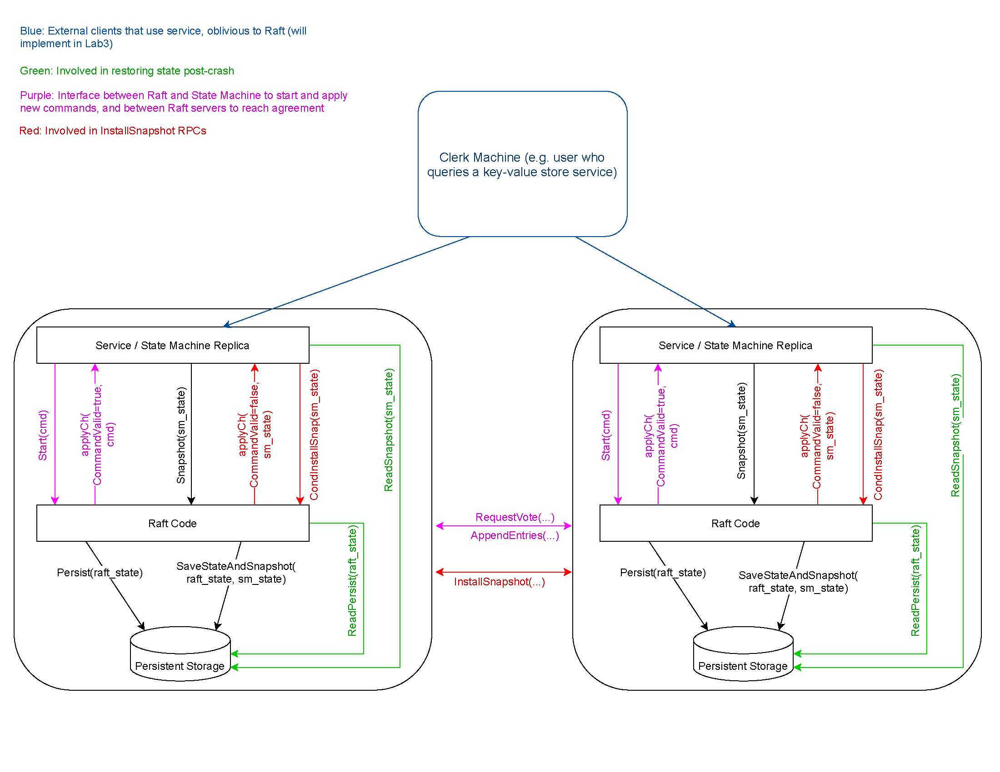
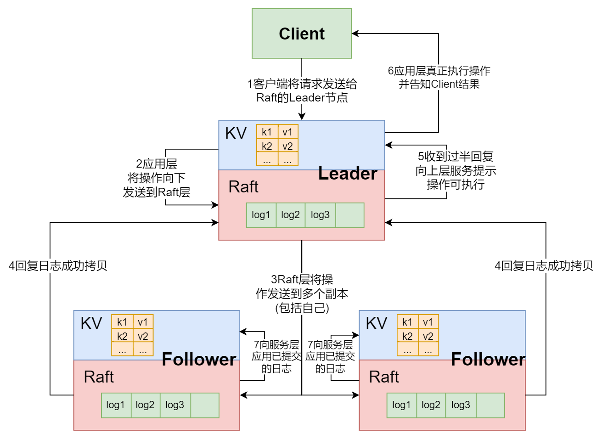
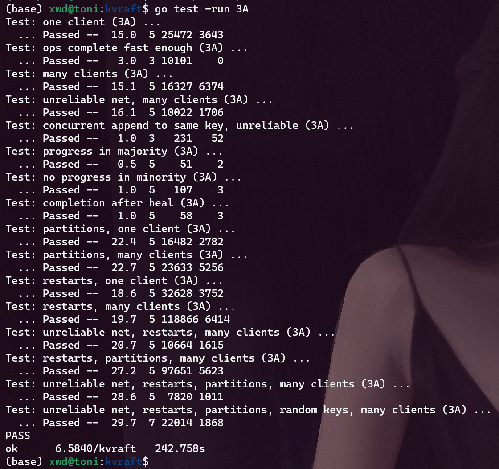

本文将介绍`lab3A`部分的实现, `lab3A`要求基于`raft`实现一个容错的分布式`KV`数据库, 但不要求实现快照, 难度还是不小

`Lab`文档见: http://nil.csail.mit.edu/6.5840/2023/labs/lab-kvraft.html

我的代码: https://github.com/ToniXWD/MIT6.5840/tree/lab3A

# 1 `lab2:Raft bug `修复
首先又是万恶的老旧代码`bug`修复
## 1.1 心跳发送逻辑修复
### 1.1.1 `bug`描述
在`lab3A`中, `kv`数据库的命令要求命令能够尽快被`commit`, 且要求比一个心跳间隔更快, 但我在`lab2`的实现中, 无论是否调用了`Start`, 都不影响心跳的发送频率, 因此自然`commit`速度很慢, 过不了测试。因此需要修改`lab2`中`Start`, 使其立即唤醒一次心跳

### 1.1.2 修改方案
由于需要在发送心跳的携程函数`SendHeartBeats`外控制心跳发送, 因此可以简单地修改`SendHeartBeats`通过事件触发心跳发送, 而不是发送后简单地`Sleep`,
1. 首先设置一个心跳定时器
```go
type Raft struct {
    ...
    heartTimer *time.Timer
    ...
}
```
2. `SendHeartBeats`通过事件触发心跳发送
```go
func (rf *Raft) SendHeartBeats() {
	for !rf.killed() {
		<-rf.heartTimer.C
		...
		rf.ResetHeartTimer(HeartBeatTimeOut)
	}
}

func (rf *Raft) ResetHeartTimer(timeStamp int) {
	rf.heartTimer.Reset(time.Duration(timeStamp) * time.Millisecond)
}
```
3. `Start`函数理解触发心跳
```go
func (rf *Raft) Start(command interface{}) (int, int, bool) {
    ...
	defer func() {
		rf.ResetHeartTimer(1)
	}()

	return rf.VirtualLogIdx(len(rf.log) - 1), rf.currentTerm, true
}
```
其余重设定时器的地方就不在赘述了

## 1.2 投票逻辑修复
### 1.2.1 `bug`描述
简单说就是某节点2轮选举撞在了一起, 首先先回顾选举相关的结构体成员:
```go
type Raft struct {
    ...
	muVote    sync.Mutex // 保护投票数据
	voteCount int        // 票数
    ...
}
```
这个`bug`原来本来是没有的, 因为之前`Start`并不会立即发送心跳，所以不容易出现如`RPC`重复, `RPC`乱序等问题, 但修改了`Start`后, 并发场景更复杂, 因此出现了如下的场景:
1. 某一时刻`Follower 2`进行选举
2. `Follower 2`选举还没结束时, 又收到了新的`Leader`的心跳, 证明选举结束了, 但由于选举的某个携程的`RPC`响应很慢, 其还没有进行选举是否结束(自身变为了`Follower`)的判断
3. 选举超时又被触发, `Follower 2`进行新一轮选举, 由于票数是以结构体成员`voteCount`保存的, 因此`voteCount`可能与之前的选票发生冲突

### 1.2.2 修改方案
既然结构体成员会发生冲突, 那不如为每轮选票临时创建一个成员和投票锁:
```go
func (rf *Raft) Elect() {
	// 特别注意, 要先对muVote加锁, 再对mu加锁, 这是为了统一获取锁的顺序以避免死锁

	...
	voteCount := 1      // 自己有一票
	var muVote sync.Mutex // 临时的投票锁
	...

	for i := 0; i < len(rf.peers); i++ {
		if i == rf.me {
			continue
		}
		go rf.collectVote(i, args, &muVote, &voteCount)
	}
}
```
`collectVote`函数就不展示了, 将原来的结构体成员`muVote`和`voteCount`换为临时创建的变量即可

# 2 KV数据库架构
首先先贴出官方提供的架构图:



简单说, 我们要建立的`KV`数据库是位于`raft`层之上的, 或者说我们的`KV`数据库使用了`raft`库。客户端（就是代码中的`clerk`）调用应用层(`server`)的`RPC`，应用层收到`RPC`之后，会调用`Start`函数，`Start`函数会立即返回，但是这时，应用层不会返回消息给客户端，因为它还没有执行客户端请求，它也不知道这个请求是否会被`Raft`层`commit`。只有在某一时刻，对应于这个客户端请求的消息在`applyCh channel`中出现, 应用层才会执行这个请求，并返回响应给客户端。

对于上述过程, 可参考我在课堂笔记中画的图:



# 3 设计思路
## 3.1 为什么会线性不一致?
`clerk`和真正的客户端交互并管理`RPC`, 而`server`收到请求后需要将请求传递给`raft`层进行集群复制, 然后收到`raft`的`commit`, 在应用到状态机并返回给客户端。

但问题在于需要确保以上操作的线性一致性， 那什么时候会出现线形不一致的情况呢？就是重复的请求。因为网络问题，`clerk`可能认为之前的请求丢包了， 所以会再次发送请求。而`raft`层是无法判断这个请求是否重复的, 如果`server`层没有特殊处理, 有的请可能在客户端看来只执行了一次, 但在`server`执行了多次, 并且如果这是`Put`等改变状态机的请求, 执行了多次将导致逻辑错误。

## 3.2 实现线性一致性的思路
### 3.2.1 如何判断重复请求？
首先，`server`需要判断某一个请求是否重复，最简单的方法就是让`clerk`携带一个全局递增的序列号，并且`server`需要在第一次将这个请求应用到状态机时记录这个序列号, 用以判断后续的请求是否重复。由于`clerk`不是并发的, 所以`server`只需要记录某个`clerk`序列号最高的一个请求即可, 序列号更低的请求不会出现, 只需要考虑请求重复的场景。

### 3.2.2 如何处理重复请求？
除了记录某个`clerk`请求的序列号外， 还需要记录器执行结果，因为如果是一个重复的`Get`请求, 其返回的结果应该与其第一次发送请求时一致, 否则将导致线性不一致。如果是重复的`Put`等改变状态机的请求，就不应该被执行

**总结下来, 思路就是:**
1. 重复的`Put/Append`请求只在第一次出现时应用到状态机
2. 记录每次应用到状态机的请求结果和序列号

# 4 具体实现
## 4.1 `client`实现
### 4.1.1 结构体设计
先贴代码:
```go
type Clerk struct {
	servers    []*labrpc.ClientEnd
	seq        uint64
	identifier int64
	leaderId   int
}
```
`identifier`用于标识`clerk`, `seq`是单调递增的序列号, 标记请求, `identifier`和`seq`一起标记了唯一的请求, `leaderId`记录领导者

### 4.1.2 `client RPC`设计
#### 4.1.2.1 `RPC`结构体设计
`RPC`请求只需要额外携带`identifier`和`seq`, `RPC`回复则需要携带结果和错误信息:
```go
type PutAppendArgs struct {
	Key        string
	Value      string
	Op         string // "Put" or "Append"
	Seq        uint64
	Identifier int64
}

type PutAppendReply struct {
	Err Err
}

type GetArgs struct {
	Key        string
	Seq        uint64
	Identifier int64
}

type GetReply struct {
	Err   Err
	Value string
}
```

#### 4.1.2.2 `Put/Append`
这2个函数很简单 ,不断轮询`server`即可, 但是需要注意, 如果对方返回了超时错误和通道关闭错误等意料之外的错误, 需要重试

```go
func (ck *Clerk) Get(key string) string {
	args := &GetArgs{Key: key, Seq: ck.GetSeq(), Identifier: ck.identifier}

	for {
		reply := &GetReply{}
		ok := ck.servers[ck.leaderId].Call("KVServer.Get", args, reply)
		if !ok || reply.Err == ErrNotLeader || reply.Err == ErrLeaderOutDated {
			ck.leaderId += 1
			ck.leaderId %= len(ck.servers)
			continue
		}

		switch reply.Err {
		case ErrChanClose:
			continue
		case ErrHandleOpTimeOut:
			continue
		case ErrKeyNotExist:
			return reply.Value
		}

		return reply.Value
	}
}

func (ck *Clerk) PutAppend(key string, value string, op string) {
	// You will have to modify this function.
	args := &PutAppendArgs{Key: key, Value: value, Op: op, Seq: ck.GetSeq(), Identifier: ck.identifier}

	for {
		reply := &PutAppendReply{}
		ok := ck.servers[ck.leaderId].Call("KVServer.PutAppend", args, reply)
		if !ok || reply.Err == ErrNotLeader || reply.Err == ErrLeaderOutDated {
			ck.leaderId += 1
			ck.leaderId %= len(ck.servers)
			continue
		}

		switch reply.Err {
		case ErrChanClose:
			continue
		case ErrHandleOpTimeOut:
			continue
		}
		return
	}
}

func (ck *Clerk) Put(key string, value string) {
	ck.PutAppend(key, value, "Put")
}
func (ck *Clerk) Append(key string, value string) {
	ck.PutAppend(key, value, "Append")
}
```

> 重试`RPC`时, 需要新建`reply`结构体, 重复使用同一个结构体将导致`labgob`报错

## 4.2 `Server`实现
### 4.2.1 `Server`设计思路
根据前文分析可知, `RPC handler`(就是`Get/Put handler`)只会在`raft`层的`commit`信息到达后才能回复, 因此其逻辑顺序就是
1. 将请求封装后通过接口`Start`交付给`raft`层
   1. 如果`raft`层节点不是`Leader`, 返回相应错误
   2. 否则继续
2. 等待`commit`信息
   1. 信息到达, 根据`commit`信息处理回复(具体是什么样的信息回复后面会说)
   2. 超时, 返回相应错误

分析到这里可知, 必然有一个协程在不断地接收`raft`层的`commit`日志(此后称为`ApplyHandler`协程), 那上述提到的重复`RPC`判别和处理是在`ApplyHandler`中进行, 还是在`RPC handler`中进行呢?

我的处理方式是在`ApplyHandler`中进行, 因为`ApplyHandler`是绝对串行的, 在其中处理这些日志是最安全的, 否则通过通道发送给`RPC handler`货条件变量唤醒`RPC handler`, 都存在一些并发同步的问题, 因此, `ApplyHandler`需要进行重复`RPC`判别和处理(可能需要存储), 并将这个请求(`commit log`就对应一个请求)的结果返回给`RPC handler`

### 4.2.2 结构体设计
因此, 通过上述分析, `server`结构体如下:
```go
type KVServer struct {
	mu         sync.Mutex
	me         int
	rf         *raft.Raft
	applyCh    chan raft.ApplyMsg
	dead       int32                // set by Kill()
	waiCh      map[int]*chan result // 映射 startIndex->ch
	historyMap map[int64]*result    // 映射 Identifier->*result

	maxraftstate int // snapshot if log grows this big
	maxMapLen    int
	db           map[string]string
}

type result struct {
	LastSeq uint64
	Err     Err
	Value   string
	ResTerm int
}
```
其中:
- `historyMap`记录某`clerk`的最高序列号的请求的序列号和结果`result`
- `result`结构体存储一个请求的序列号和结果, 以及`ResTerm`记录`commit`被`apply`时的`term`, 因为其可能与`Start`相比发生了变化, 需要将这一信息返回给客户端
- `waiCh`纪录等待`commit`信息的`RPC handler`的通道
  
### 4.2.3 `RPC handler`设计
`RPC handler`设计较为简单,只需要调用`Start`, 等待`commit`信息即可, 不过还需要考虑超时的错误处理
```go
func (kv *KVServer) Get(args *GetArgs, reply *GetReply) {
	// 先判断是不是leader
	_, isLeader := kv.rf.GetState()
	if !isLeader {
		reply.Err = ErrNotLeader
		return
	}
	opArgs := &Op{OpType: OPGet, Seq: args.Seq, Key: args.Key, Identifier: args.Identifier}

	res := kv.HandleOp(opArgs)
	reply.Err = res.Err
	reply.Value = res.Value
}

func (kv *KVServer) PutAppend(args *PutAppendArgs, reply *PutAppendReply) {
	// Your code here.
	// 先判断是不是leader
	_, isLeader := kv.rf.GetState()
	if !isLeader {
		reply.Err = ErrNotLeader
		return
	}

	opArgs := &Op{Seq: args.Seq, Key: args.Key, Val: args.Value, Identifier: args.Identifier}
	if args.Op == "Put" {
		opArgs.OpType = OPPut
	} else {
		opArgs.OpType = OPAppend
	}

	res := kv.HandleOp(opArgs)
	reply.Err = res.Err
}
```
`Get`和`PutAppend`都将请求封装成`Op`结构体, 统一给`HandleOp`处理, `HandleOp`处理`ApplyHandler`发过来的`commit`信息并生成回复, 这里我采用的通信方式是管道, 每一个请求会将自己创建的管道存储在`waiCh`中, 并在函数离开时清理管道和`waiCh`:
```go
func (kv *KVServer) HandleOp(opArgs *Op) (res result) {
	startIndex, startTerm, isLeader := kv.rf.Start(*opArgs)
	if !isLeader {
		return result{Err: ErrNotLeader, Value: ""}
	}

	kv.mu.Lock()

	// 直接覆盖之前记录的chan
	newCh := make(chan result)
	kv.waiCh[startIndex] = &newCh
	DPrintf("leader %v identifier %v Seq %v 的请求: 新建管道: %p\n", kv.me, opArgs.Identifier, opArgs.Seq, &newCh)
	kv.mu.Unlock() // Start函数耗时较长, 先解锁

	defer func() {
		kv.mu.Lock()
		delete(kv.waiCh, startIndex)
		close(newCh)
		kv.mu.Unlock()
	}()

	// 等待消息到达或超时
	select {
	case <-time.After(HandleOpTimeOut):
		res.Err = ErrHandleOpTimeOut
		DPrintf("server %v identifier %v Seq %v: 超时", kv.me, opArgs.Identifier, opArgs.Seq)
		return
	case msg, success := <-newCh:
		if success && msg.ResTerm == startTerm {
			res = msg
			return
		} else if !success {
			// 通道已经关闭, 有另一个协程收到了消息 或 通道被更新的RPC覆盖
			// TODO: 是否需要判断消息到达时自己已经不是leader了?
			DPrintf("server %v identifier %v Seq %v: 通道已经关闭, 有另一个协程收到了消息 或 更新的RPC覆盖, args.OpType=%v, args.Key=%+v", kv.me, opArgs.Identifier, opArgs.Seq, opArgs.OpType, opArgs.Key)
			res.Err = ErrChanClose
			return
		} else {
			// term与一开始不匹配, 说明这个Leader可能过期了
			DPrintf("server %v identifier %v Seq %v: term与一开始不匹配, 说明这个Leader可能过期了, res.ResTerm=%v, startTerm=%+v", kv.me, opArgs.Identifier, opArgs.Seq, res.ResTerm, startTerm)
			res.Err = ErrLeaderOutDated
			res.Value = ""
			return
		}
	}
}
```
这里需要额外注意错误处理:
1. 超时错误
2. 通道关闭错误
3. `Leader`可能过期的错误(`term`不匹配)
4. 不是`Leader`的错误

同时这里还有一个难点, 就是如果出现了重复的`RPC`, 他们都在等待`commit`信息, 那么他们的管道存储在`waiCh`中的`key`是什么呢? 如果使用`Identifier`或`Seq`, 那么必然后来的`RPC`会覆盖之前的管道, 可能造成错误, 因为两个重复`RPC`的`Identifier`或`Seq`是一样的。 这里可以巧妙地利用`Start`函数的第一个返回值， 其代表如果`commit`成功, 其日志项的索引号, 由于`raft`层不区分重复`RPC`的`log`, 因此这个索引号肯定是不同的, 不会相互覆盖

### 4.2.4 `ApplyHandler`设计
`ApplyHandler`是`3A`的最核心的部分, 其思路是:
1. 先判断`log`请求的`Identifier`和`Seq`是否在历史记录`historyMap`中是否存在, 如果存在就直接返回历史记录
2. 不存在就需要应用到状态机, 并更新历史记录`historyMap`
3. 如果`log`请求的`CommandIndex`对应的`key`在`waiCh`中存在, 表面当前节点可能是一个`Leader`, 需要将结果发送给`RPC handler`
```go
func (kv *KVServer) ApplyHandler() {
	for !kv.killed() {
		log := <-kv.applyCh

		if log.CommandValid {

			op := log.Command.(Op)
			kv.mu.Lock()

			// 需要判断这个log是否需要被再次应用
			var res result

			needApply := false
			if hisMap, exist := kv.historyMap[op.Identifier]; exist {
				if hisMap.LastSeq == op.Seq {
					// 历史记录存在且Seq相同, 直接套用历史记录
					res = *hisMap
				} else if hisMap.LastSeq < op.Seq {
					// 否则新建
					needApply = true
				}
			} else {
				// 历史记录不存在
				needApply = true
			}

			_, isLeader := kv.rf.GetState()

			if needApply {
				// 执行log
				res = kv.DBExecute(&op, isLeader)
				res.ResTerm = log.SnapshotTerm

				// 更新历史记录
				kv.historyMap[op.Identifier] = &res
			}

			if !isLeader {
				// 不是leader则继续检查下一个log
				kv.mu.Unlock()
				continue
			}

			// Leader还需要额外通知handler处理clerk回复
			ch, exist := kv.waiCh[log.CommandIndex]
			if !exist {
				// 接收端的通道已经被删除了并且当前节点是 leader, 说明这是重复的请求, 但这种情况不应该出现, 所以panic
				DPrintf("leader %v ApplyHandler 发现 identifier %v Seq %v 的管道不存在, 应该是超时被关闭了", kv.me, op.Identifier, op.Seq)
				kv.mu.Unlock()
				continue
			}
			kv.mu.Unlock()
			// 发送消息
			func() {
				defer func() {
					if recover() != nil {
						// 如果这里有 panic，是因为通道关闭
						DPrintf("leader %v ApplyHandler 发现 identifier %v Seq %v 的管道不存在, 应该是超时被关闭了", kv.me, op.Identifier, op.Seq)
					}
				}()
				res.ResTerm = log.SnapshotTerm
				*ch <- res
			}()
		}
	}
}
```

这里有几大易错点:
1. 需要额外传递`Term`以供`RPC handler`判断与调用`Start`时相比, `term`是否变化, 如果变化, 可能是`Leader`过期, 需要告知`clerk`
2. 发送消息到通道时, 需要解锁
3. 因为发送消息到通道时解锁, 所以通道可能被关闭, 因此需要单独在一个函数中使用`recover`处理发送消息到不存在的通道时的错误
4. 这个`ApplyHandler`是`leader`和`follower`都存在的协程, 只不过`follower`到应用到状态机和判重那里就结束了, `leader`多出来告知`RPC handler`结果的部分

`DBExecute`就是将日志项应用到状态机, 逻辑很简单:
```go
func (kv *KVServer) DBExecute(op *Op, isLeader bool) (res result) {
	// 调用该函数需要持有锁
	res.LastSeq = op.Seq
	switch op.OpType {
	case OPGet:
		val, exist := kv.db[op.Key]
		if exist {
			kv.LogInfoDBExecute(op, "", val, isLeader)
			res.Value = val
			return
		} else {
			res.Err = ErrKeyNotExist
			res.Value = ""
			kv.LogInfoDBExecute(op, "", ErrKeyNotExist, isLeader)
			return
		}
	case OPPut:
		kv.db[op.Key] = op.Val
		kv.LogInfoDBExecute(op, "", kv.db[op.Key], isLeader)
		return
	case OPAppend:
		val, exist := kv.db[op.Key]
		if exist {
			kv.db[op.Key] = val + op.Val
			kv.LogInfoDBExecute(op, "", kv.db[op.Key], isLeader)
			return
		} else {
			kv.db[op.Key] = op.Val
			kv.LogInfoDBExecute(op, "", kv.db[op.Key], isLeader)
			return
		}
	}
	return
}
```

# 5 测试
执行测试命令
```bash
go test -v -run 3A
```
结果如下:


该代码经过150次测试没有报错