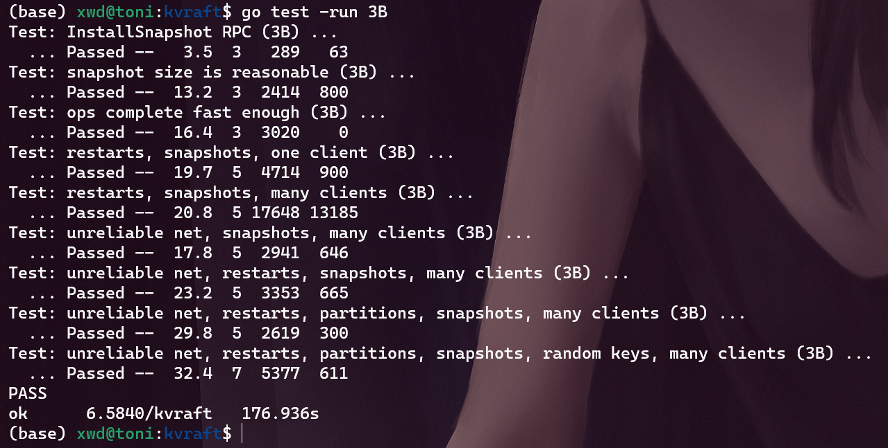
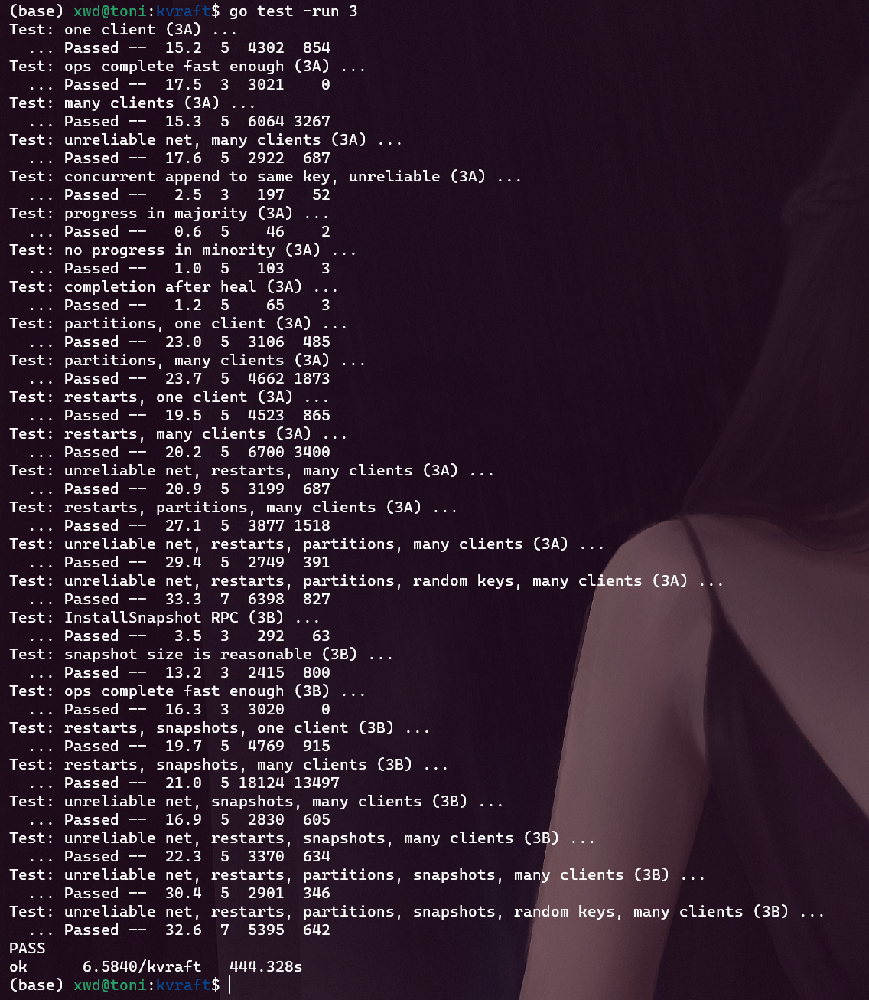
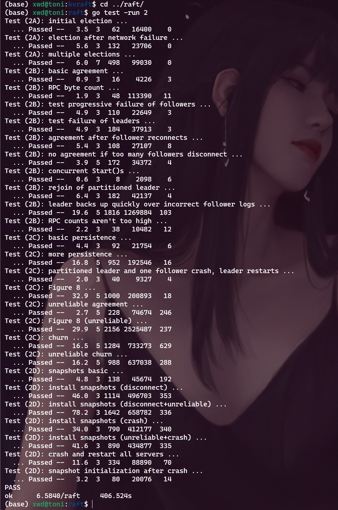

本文将介绍`lab3B`部分的实现, `lab3B`要求基于在`lab3A`的基础上实现快照, 仅从`lab`本省来讲其实很简单, 可以说是目前我做的所有`lab`里面难度最小的一个模块了, 但实际上遇到了很多困难, 调试的时间比`lab3A`还久, 核心原因就是自己的`lab2`实现的`raft`底层有一些问题(真真真真太折磨了, 即时过了所有单元测试, 还是时不时地在后续的`lab`暴露出问题来, 并且这些问题还挺难定位, 得仔细分析海量的`log`输出才可以)

`Lab`文档见: http://nil.csail.mit.edu/6.5840/2023/labs/lab-kvraft.html

我的代码: https://github.com/GFX9/MIT6.5840/tree/lab3B

# 1 快照的生成和传递逻辑
简单说, `lab3B`就是要在底层`raft`的`log`过大时生成快照并截断日志, 从而节省内存空间, 并且快照会持久化存储到本地。因此， 原来的代码结构只需要在以下几个方面做出调整：
1. 需要再某个地方定期地判断底层`raft`的日志大小, 决定是否要生成快照, 生成快照直接调用我们在`lab2`中实现的接口`Snapshot`即可
2. 由于`follower`的底层`raft`会出现无法从`Leader`获取`log`的情况, 这时`Leader`会发送给`follower`的`raft`层一个快照, `raft`层会将其上交给`server`, `server`通过快照改变自己的状态机
3. `server`启动时需要判断是否有持久化的快照需要加载, 如果有就加载

# 2 代码实现
## 2.1 快照应该包含什么?
快照首先应该包含的肯定是内存中的`KV`数据库, 也就是自己维护的`map`, 但是还应该包含对每个`clerk`序列号的记录信息, 因为从快照恢复后的`server`应该具备判断重复的客户端请求的能力, 同时也应该记录最近一次应用到状态机的日志索引, 凡是低于这个索引的日志都是包含在快照中

因此, `server`结构体需要添加如下成员:
```go
type KVServer struct {
    ...
	persister    *raft.Persister
	lastApplied  int
}
```


## 2.2 加载和生成快照
通过上述分析, 快照的加载和生成就很简单了,代码如下:
```go
func (kv *KVServer) GenSnapShot() []byte {
	// 调用时必须持有锁mu
	w := new(bytes.Buffer)
	e := labgob.NewEncoder(w)

	e.Encode(kv.db)
	e.Encode(kv.historyMap)

	serverState := w.Bytes()
	return serverState
}

func (kv *KVServer) LoadSnapShot(snapShot []byte) {
	// 调用时必须持有锁mu
	if len(snapShot) == 0 || snapShot == nil {
		ServerLog("server %v LoadSnapShot: 快照为空", kv.me)
		return
	}

	r := bytes.NewBuffer(snapShot)
	d := labgob.NewDecoder(r)

	tmpDB := make(map[string]string)
	tmpHistoryMap := make(map[int64]*Result)
	if d.Decode(&tmpDB) != nil ||
		d.Decode(&tmpHistoryMap) != nil {
		ServerLog("server %v LoadSnapShot 加载快照失败\n", kv.me)
	} else {
		kv.db = tmpDB
		kv.historyMap = tmpHistoryMap
		ServerLog("server %v LoadSnapShot 加载快照成功\n", kv.me)
	}
}
```

`GenSnapShot`和`LoadSnapShot`分别生成和加载快照, 唯一需要注意的就是这两个函数应当在持有锁时才能调用

## 2.3 生成快照的时机判断
由于`ApplyHandler`协程会不断地读取`raft commit`的通道, 所以每收到一个`log`后进行判断即可:
```go
func (kv *KVServer) ApplyHandler() {
	for !kv.killed() {
		log := <-kv.applyCh
		if log.CommandValid {
			...
			// 如果在follower一侧, 可能这个log包含在快照中, 直接跳过
			if log.CommandIndex <= kv.lastApplied {
				kv.mu.Unlock()
				continue
			}
			...
			// 每收到一个log就检测是否需要生成快照
			if kv.maxraftstate != -1 && kv.persister.RaftStateSize() >= kv.maxraftstate/100*95 {
				// 当达到95%容量时需要生成快照
				snapShot := kv.GenSnapShot()
				kv.rf.Snapshot(log.CommandIndex, snapShot)
			}
			kv.mu.Unlock()
		}
        ...
	}
}
```
这里还需要进行之前提到的判断: 低于`lastApplied`索引的日志都是包含在快照中, 在尽显`lab3A`的操作之后, 再判断是否需要生成快照, 在我的实现中, 如果仅仅比较`maxraftstate`和`persister.RaftStateSize()`相等才生成快照的话, 无法通过测例, 因为可能快照`RPC`存在一定延时, 所以我采用的手段是只要达到阈值的95%, 就生成快照

## 2.4 加载快照的时机判断
首先启动时需要判断是否需要加载快照, 然后就是`ApplyHandler`从通道收到快照时需要判断加载, 都很简单:
```go
func StartKVServer(servers []*labrpc.ClientEnd, me int, persister *raft.Persister, maxraftstate int) *KVServer {
	...
	kv.persister = persister
    ...

	// 先在启动时检查是否有快照
	kv.mu.Lock()
	kv.LoadSnapShot(persister.ReadSnapshot())
	kv.mu.Unlock()

	go kv.ApplyHandler()

	return kv
}
```
```go
func (kv *KVServer) ApplyHandler() {
	for !kv.killed() {
		log := <-kv.applyCh
		if log.CommandValid {
            ...
		} else if log.SnapshotValid {
			// 日志项是一个快照
			kv.mu.Lock()
			if log.SnapshotIndex >= kv.lastApplied {
				kv.LoadSnapShot(log.Snapshot)
				kv.lastApplied = log.SnapshotIndex
			}
			kv.mu.Unlock()
		}
	}
}
```

# 3 调试Bug和修复
这里才是这个`lab`的重头戏, 我在完成上述所有修改后, 会在`TestSnapshotUnreliable3B`这个单元测试中大概率卡死, 一直会卡到`go`默认的十分钟单元测试时间截止后才报错退出, 在反复检查了**死锁**和**持锁接发通道消息**等常见问题并确认无误后, 我再次观察超时报错的堆栈信息和日志输出, 得到结论就是: 
**`raft`层因为无法承受测试的高并发程度而导致大量的`RPC`请求失败, 从而导致`clerk`无限重复发送请求`RPC`(我的实现是`RPC`请求失败)就重试**

......陷入了沉思, 自己还是菜啊, 但代码还得慢慢修, 总不能把`raft`推倒重来吧......

我最后分别从`raft`层和`server`层进行了优化

## 3.1 `raft`层优化
### 3.1.1 修复过多的`AppendEntries RPC`
通过对日志的调试发现, `AppendEntries RPC`数量太多了, 这是因为我在`lab3A`中做了如下修改:
```go
func (rf *Raft) Start(command interface{}) (int, int, bool) {
	...
	defer func() {
		rf.ResetHeartTimer(1)
	}()

	return rf.VirtualLogIdx(len(rf.log) - 1), rf.currentTerm, true
}
```
也就是在接受一个请求并追加一个`log`后立即发送`AppendEntries RPC`, 但是如果在高并发的场景下, 新的请求绵绵不断地到来, 每到达一个请求都发一个`RPC`, 并且每个`RPC`可能只包含了长度为1的日志切片, 这是不太合理的设计, 过多的`RPC`使得`raft`无法及时处理而出现`RPC`卡死的情况, 因此, 我手动修改了重置定时器的时间为`15ms`, 这个值比心跳间隔小很多, 但又不是很小, 足以在满足响应速度的前提下摊销多个命令, 使一次`AppendEntries RPC`包含多个新的日志项:
```go
func (rf *Raft) Start(command interface{}) (int, int, bool) {
	...
	defer func() {
		rf.ResetHeartTimer(15)
	}()

	return rf.VirtualLogIdx(len(rf.log) - 1), rf.currentTerm, true
}
```
至于为什么是`15ms`..., 我自己也说不出理由, 随便设的, 比心跳小很多, 但又不太小就是了, **本质目的就是积攒多个`AppendEntries RPC`后一次性发送, 避免`AppendEntries RPC`数量过大**

### 3.1.2 修复过多的`InstallSnapshot RPC`
在我原来的设计中, `InstallSnapshot RPC`的发送有2中情形:
1. `handleAppendEntries`在处理`AppendEntries RPC`回复时发现`follower`需要的日志项背快照截断, 立即调用`go rf.handleInstallSnapshot(serverTo)`协程发送快照
2. 心跳函数发送时发现`PrevLogIndex < rf.lastIncludedIndex`, 则发送快照

这和之前的情形类似, 在高并发的场景下，`follower`和`Leader`之间的日志复制也很频繁, 如果某一个日志触发了`InstallSnapshot RPC`的发送, 接下来连续很多个日志也会触发`InstallSnapshot RPC`的发送, 因为`InstallSnapshot RPC`的发送时间消耗更大, 这样以来, 又加大了`raft`的压力, 所以, 我对`InstallSnapshot RPC`的发送做出修改:
1. `handleAppendEntries`在处理`AppendEntries RPC`回复时发现`follower`需要的日志项背快照截断, 仅仅设置`rf.nextIndex[serverTo] = rf.lastIncludedIndex`, 这将导致下一次心跳时调用`go rf.handleInstallSnapshot(serverTo)`协程发送快照
2. 心跳函数发送时发现`PrevLogIndex < rf.lastIncludedIndex`, 则发送快照

代码如下:
```go
func (rf *Raft) handleAppendEntries(serverTo int, args *AppendEntriesArgs) {
    ...
	if reply.Term == rf.currentTerm && rf.role == Leader {
		// term仍然相同, 且自己还是leader, 表名对应的follower在prevLogIndex位置没有与prevLogTerm匹配的项
		// 快速回退的处理
		if reply.XTerm == -1 {
			// PrevLogIndex这个位置在Follower中不存在
			DPrintf("leader %v 收到 server %v 的回退请求, 原因是log过短, 回退前的nextIndex[%v]=%v, 回退后的nextIndex[%v]=%v\n", rf.me, serverTo, serverTo, rf.nextIndex[serverTo], serverTo, reply.XLen)
			if rf.lastIncludedIndex >= reply.XLen {
				// 由于snapshot被截断
				// 下一次心跳添加InstallSnapshot的处理
				rf.nextIndex[serverTo] = rf.lastIncludedIndex
			} else {
				rf.nextIndex[serverTo] = reply.XLen
			}
			return
		}
		...
		if i == rf.lastIncludedIndex && rf.log[rf.RealLogIdx(i)].Term > reply.XTerm {
			// 要找的位置已经由于snapshot被截断
			// 下一次心跳添加InstallSnapshot的处理
			rf.nextIndex[serverTo] = rf.lastIncludedIndex
		} else if rf.log[rf.RealLogIdx(i)].Term == reply.XTerm {
			...
		} else {
			// 之前PrevLogIndex发生冲突位置时, Follower的Term自己没有
			if reply.XIndex <= rf.lastIncludedIndex {
				// XIndex位置也被截断了
				// 添加InstallSnapshot的处理
				rf.nextIndex[serverTo] = rf.lastIncludedIndex
			} else {
				rf.nextIndex[serverTo] = reply.XIndex
			}
		}
		return
	}
}
```

## 3.2 `server`层优化
`server`层应该尽量减小对`raft`层的接口的调用, 因为大量的接口调用将获取`raft`层的一把大锁, 从而阻碍`RPC`的响应
### 3.2.1 调用`Start`前过滤
之前的实现中, 无论是`Put/Append`还是`Get`, 都是封装成`OP`结构体, 在`HandleOp`中一股脑调用`Start`扔给`raft`层处理, 然后在`ApplyHandler`处进行去重判断, 现在可以在调用`raft`层的`Start`之前就从`historyMap`中判断是否有历史记录可以直接返回:
```go
func (kv *KVServer) HandleOp(opArgs *Op) (res Result) {
	// 先判断是否有历史记录
	kv.mu.Lock()
	if hisMap, exist := kv.historyMap[opArgs.Identifier]; exist && hisMap.LastSeq == opArgs.Seq {
		kv.mu.Unlock()
		ServerLog("leader %v HandleOp: identifier %v Seq %v 的请求: %s(%v, %v) 从历史记录返回\n", kv.me, opArgs.Identifier, opArgs.OpType, opArgs.Key, opArgs.Val)
		return *hisMap
	}
	kv.mu.Unlock()
    ...
}
```

### 3.2.2 减少`GetState`的调用
`ratf`的`GetState`也会获取锁, 从而阻碍`RPC`的响应速度, 我原来的实现中, `GetState`会在2个地方调用:
1. `Get`和`PutAppend`调用`GetState`判断是否是`leader`, 不是则返回错误
2. `ApplyHandler`在通过通道唤醒`HandleOp`时, 需要判断当前节点是不是`leader`, 不是`leader`则不需要唤醒

以上2不操作看似合理, 但实际上是冗余的:
1. 首先, `Get`和`PutAppend`在后续的`HandleOp`会调用`Start`, `Start`也会因为当前节点不是`leader`而返回, 所以`GetState`是冗余的, 反而阻碍`RPC`响应速度
2. 其次, `ApplyHandler`在通过通道唤醒`HandleOp`时, 日志项本身有`term`的记录, `HandleOp`会调用`Start`时也会获取那时的`term`, `HandleOp`只需要在被唤醒后比较前后的`term`是否相同, 就可以判断出当前的节点是不是一个过时的`leader`

以上2处修改很简单, 由于是删代码而不是新增和修改, 就不贴代码了, 感兴趣可以看仓库

### 3.2.3 `clerk`先`sleep`再重试
这个修改也很简单, 如果`server`返回了需要重试类型的错误, `clerk`先`sleep`一会, 再重试, 代码如下:
```go
func (ck *Clerk) Get(key string) string {
	args := &GetArgs{Key: key, Seq: ck.GetSeq(), Identifier: ck.identifier}

	for {
		reply := &GetReply{}
		ok := ck.servers[ck.leaderId].Call("KVServer.Get", args, reply)
		if !ok || reply.Err == ErrNotLeader || reply.Err == ErrLeaderOutDated {
			if !ok {
				reply.Err = ERRRPCFailed
			}
			if reply.Err != ErrNotLeader {
				DPrintf("clerk %v Seq %v 重试Get(%v), Err=%s", args.Identifier, args.Key, args.Key, reply.Err)
			}

			ck.leaderId += 1
			ck.leaderId %= len(ck.servers)
			time.Sleep(RpcRetryInterval)
			continue
		}

		switch reply.Err {
		case ErrChanClose:
			DPrintf("clerk %v Seq %v 重试Get(%v), Err=%s", args.Identifier, args.Key, args.Key, reply.Err)
			time.Sleep(time.Microsecond * 5)
			continue
		case ErrHandleOpTimeOut:
			DPrintf("clerk %v Seq %v 重试Get(%v), Err=%s", args.Identifier, args.Key, args.Key, reply.Err)
			time.Sleep(RpcRetryInterval)
			continue
		case ErrKeyNotExist:
			DPrintf("clerk %v Seq %v 成功: Get(%v)=%v, Err=%s", args.Identifier, args.Key, args.Key, reply.Value, reply.Err)
			return reply.Value
		}
		DPrintf("clerk %v Seq %v 成功: Get(%v)=%v, Err=%s", args.Identifier, args.Key, args.Key, reply.Value, reply.Err)

		return reply.Value
	}
}

func (ck *Clerk) PutAppend(key string, value string, op string) {
	// You will have to modify this function.
	args := &PutAppendArgs{Key: key, Value: value, Op: op, Seq: ck.GetSeq(), Identifier: ck.identifier}

	for {
		reply := &PutAppendReply{}
		ok := ck.servers[ck.leaderId].Call("KVServer.PutAppend", args, reply)
		if !ok || reply.Err == ErrNotLeader || reply.Err == ErrLeaderOutDated {
			if !ok {
				reply.Err = ERRRPCFailed
			}
			if reply.Err != ErrNotLeader {
				DPrintf("clerk %v Seq %v 重试%s(%v, %v), Err=%s", args.Identifier, args.Key, args.Op, args.Key, args.Value, reply.Err)
			}

			ck.leaderId += 1
			ck.leaderId %= len(ck.servers)
			time.Sleep(RpcRetryInterval)
			continue
		}

		switch reply.Err {
		case ErrChanClose:
			DPrintf("clerk %v Seq %v 重试%s(%v, %v), Err=%s", args.Identifier, args.Key, args.Op, args.Key, args.Value, reply.Err)
			time.Sleep(RpcRetryInterval)
			continue
		case ErrHandleOpTimeOut:
			DPrintf("clerk %v Seq %v 重试%s(%v, %v), Err=%s", args.Identifier, args.Key, args.Op, args.Key, args.Value, reply.Err)
			time.Sleep(RpcRetryInterval)
			continue
		}
		DPrintf("clerk %v Seq %v 成功: %s(%v, %v), Err=%s", args.Identifier, args.Key, args.Op, args.Key, args.Value, reply.Err)

		return
	}
}
```

# 4 测试
1. 执行测试命令测试`lab3B`
```bash
go test -run 3B
```
结果如下:

可以看出, 取消立即发送心跳广播导致前3个测例满了不少, 但也就凑活吧(~~不想优化了, 麻木了~~)

该代码经过150次测试没有报错

1. 执行测试命令测试整个`lab3`
```bash
go test -run 3
```
结果如下:

该代码经过150次测试没有报错

1. 修改后再次测试`lab2`
```bash
cd ../raft/
go test -run 2
```
结果如下:


该代码经过150次测试没有报错


