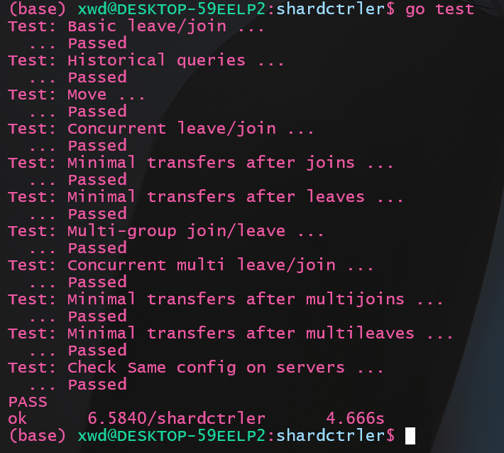

*最新的更新在博客 [ToniBlog](https://ToniXWD.github.io/)*

本文将介绍`lab4A`部分的实现, `lab4A`要求实现分片控制器, 其实就是`lab3`的翻版, 基本上可以照搬`lab3`。如果仅仅是为了通过测试，`lab4A`倒是极其简单，只需要每次更新`Group`后随机完成`Shard`的映射就好了, 但还要考虑将配置项的改动最小话, 还是有一些坑的。

`Lab`文档见: http://nil.csail.mit.edu/6.5840/2023/labs/lab-shard.html

我的代码: https://github.com/ToniXWD/MIT6.5840/tree/lab4A

# 1 项目结构
分片数据库的组成结构是：1个`controller` + 多个`replica groups`。`controller`将数据进行分片， 存储在不同的集群上， 每个集群都是一个`raft`集群, `controller`负责管理分片, 也就是管理配置项。`clients` 和 `servers` 都会询问 `controller` 最新的配置信息。 分片控制器需要具备如下的功能:
1. 为了负载均衡 -> 能够迁移分片
2. 需要处理请求和配置项更新几乎同时到达的情况
3. 建议的实现: `raft`集群也要保存配置项
4. 配置更新后, 新的负责某分片的`replica groups`需要从旧的`replica groups`复制旧分片

`Shard controller`使用下面的`RPC`来实现管理和查询:
1. `Join`:
   1. 重新分片时尽量平均
   2. 重新分片时移动的分片尽量少
   3. 允许重用`GID`
2. `Leave`
   1. 重新分片时尽量平均
   2. 重新分片时移动的分片尽量少
3. `Move`
   1. 将某个`shard`分配给某个`group`
4. `Query` 
   1. 返回配置信息
   2. 必须反映在其之前做出的配置信息更改

主要的坑包括:
1. 需要滤除重复的`RPC`(照抄`lab3`即可)
2. 执行碎片再平衡的状态机中的代码需要具有确定性(大坑)

# 2 实现思路
由于我们的目标不仅仅是通过测例, 还需要完成下面2个目标:
1. 实现负载均衡
    实现负载均衡, 意味着所有的集群被映射的数量只差不能大于1(手动`Move`的情况除外), 因此需要对已经映射的集群号(`gid`)实现统计计数
2. 最小化改动
   新配置和旧配置之间的改动要最小化

因此我的实现思路和逻辑如下:

## 2.1 `Join`
1. 首先继承旧配置`lastConfig`创建新配置`newConfig`
2. 将要`Join`的`newGroups`追加到`newConfig.Groups`, 但需要注意下面的情况
   1. `len(lastConfig.Groups) + len(newGroups) <= NShards`, 此时无脑将`Join`的`newGroups`追加到`newConfig.Groups`即可
   2. `len(lastConfig.Groups) + len(newGroups) > NShards`, 此时只需要将`newConfig.Groups`填充至`len(newConfig.Groups) == NShards`即可, 剩余的部分缓存起来, 记缓存区为`CachedGid`
3. 统计`newConfig.Groups`中对`Shard`的映射次数, 映射次数最高的和映射次数最低的绝对值不能大于1, 由于新增了目前没有映射的`Join`的新集群, 此特性不可能满足, 因此需要:
   1. 将目前对`Shard`的映射次数最少的`gid`剥夺一个映射, 被剥夺的这个映射本来是被映射到拥有`Shard`最多的一个`gid`
   2. 更新映射次数统计信息, 直到映射次数最少的`gid`(也就是之前新加入的)大于等于映射平均值(`NShards / len(newConfig.Groups)`)即可

## 2.2 `Leave`
1. 首先继承旧配置`lastConfig`创建新配置`newConfig`
2. 从`newConfig.Groups`和`newConfig.CachedGid`中移除指定的`gid`(因为可能目前所有的`gid`数量大于`NShards`, 部分被暂存到了`CachedGid`), 被移除的`gid`在`newConfig.Shards`用0标记
3. 如果`newConfig.CachedGid`还有剩余且`len(newConfig.Groups) < NShards`, 将`newConfig.CachedGid`中的`gid`移动到`newConfig.Groups`使其填充满或者使`newConfig.CachedGid`为空
4. 获取当前映射数量最少的`gid`的统计信息
5. 在`newConfig.Shards`用0标记的位置用映射数量最少的`gid`代替, 每代替一次后需要重新统计

## 2.3 `Move && Query`
这两个没啥坑, 就不说了

# 3 易错点解析
1. `Go`的`map`的迭代顺序
   `Go`的`map`的迭代顺序是无序的, 即使其插入时的顺序和数据都是相同的, 但多次进行迭代, 其顺序不一致, 因此在多个副本上想保证确定性的话, 需要先对`map`的`key`获取切片并排序
2. `gid`的数量和`NShards`的关系
   由于每个`Shard`都会映射一个`gid`, 因此如果`gid`的数量大于`NShard`的话, 会存在有`gid`映射不到的情况, 这时我的处理是将其放到暂存区, 保证`Group`中的`gid`数量
3. `map`的复制
   `Go`的`map`的复制是浅复制, 复制一个`map`时，只是复制了对底层数据结构的引用，而不是底层数据本身的副本。意味着如果在一个`map`中做出了改变（比如删除或添加键值对），这些改变会在所有对这个底层数据结构的引用中体现出来。因此，对原始`map`的修改会影响到复制后的`map`，因为它们都引用同一个数据结构。

# 4 代码实现
我自己实现的代码比较繁琐(很丑), 但逻辑其实很简单, 参见: https://github.com/ToniXWD/MIT6.5840/tree/lab4A

# 5 测试

此测试经过50次没有报错